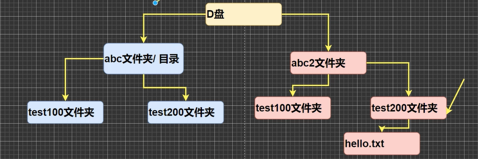

# 基本概念
windows的shell指令的一种
# 相对路径与绝对路径
相对路径：从目前目录一直上/下索引到目标路径 
绝对路径：从最高级目录开始索引
## 示例

绝对：d:\abc2\test200 
相对（从左test2到右test2）：d:..\..\abc2\test200
# 基本dos命令
- dir 查看 
dr是查看当前目录全部文件信息 
dr 绝对路径是查看任一指定目录
- cd 跳转 
cd本盘切换有两种：cd 绝对路径/cs 相对路径 
异盘只有一种：cd /D 绝对地址 
上下级切换：上级cd ..下级cd \ 
- tree 查看指定目录下的所有子目录
- clr 清空命令
- exit 退出