# 变量相关c/c++你已经学过了
# java+号
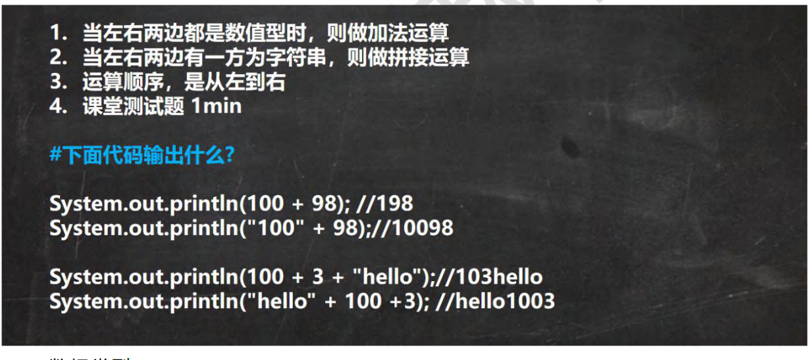
- 注意第四个例子，在从左到右进行第一个运算后被判定为string，后面就变成了字符串拼接
# 数据类型
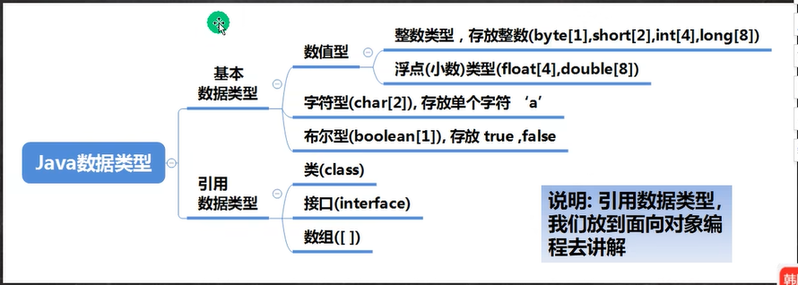 
- 基本数据类型和c、c++变量一致，引用数据类型变量即地址，值开辟在堆上
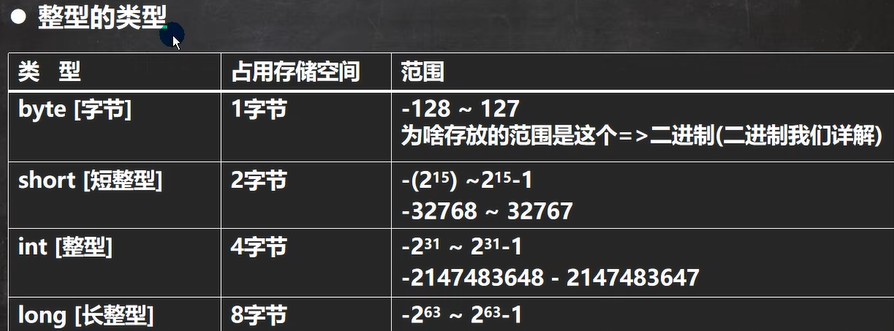
## 整型
- long型后面必须加上L/l
- java各整数类型有固定的范围与字段长度，不受OS（操作系统）的影响，以保证java程序可移植性（浮点型也一样）
## 浮点型

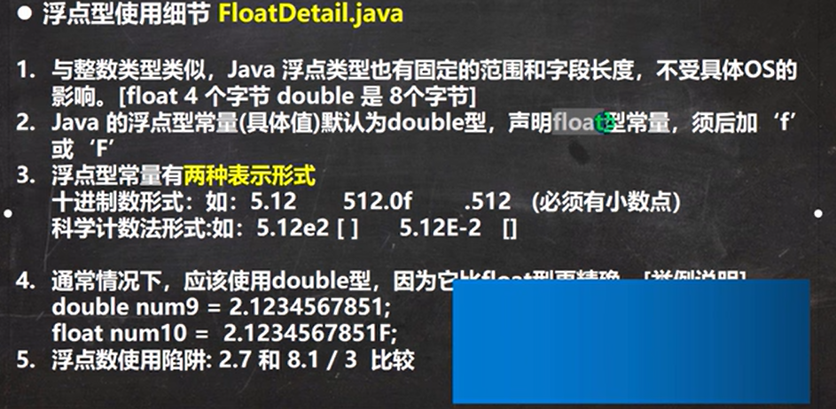
- 注意第二条，f/F要加
- 精度问题
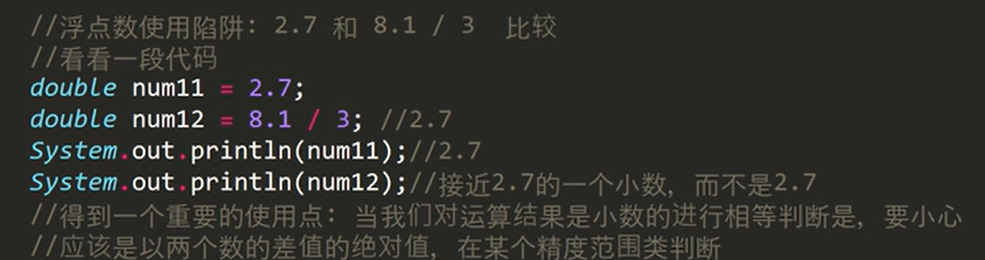
计算机以二进制储存数，一些小数可能在浮点型的有效位外才是精确值，因而会发生截断现象。就算是初始化一个小数，也可能出现这种情况。
- 插播一个快捷键：ctrl+/,把选中代码全部注释化，再次输入取消注释
## api

- 和c里面库区别可以理解为实体店买衣服和网上购物买衣服、
### java类的组织形式
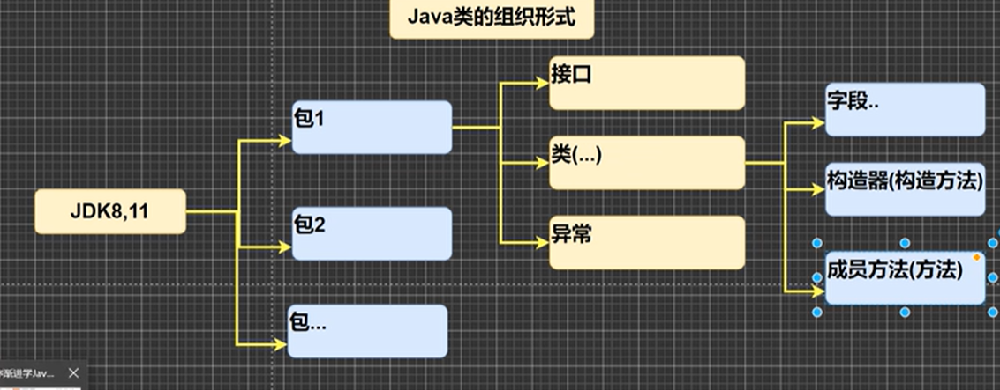
## char

- 字符值可以是转义符，并行驶转义符功能
- 不是ASCII，unicode为基础（这些的设置名为文件编码，我国运用最多的是utf-8）
- 唐突再插入一个快捷键科普：ctl+shift+d复制光标所在行并粘在下一行
### 常见几种编码类型
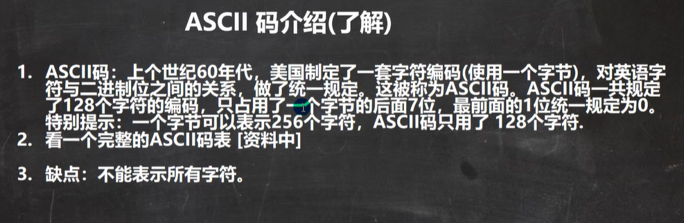
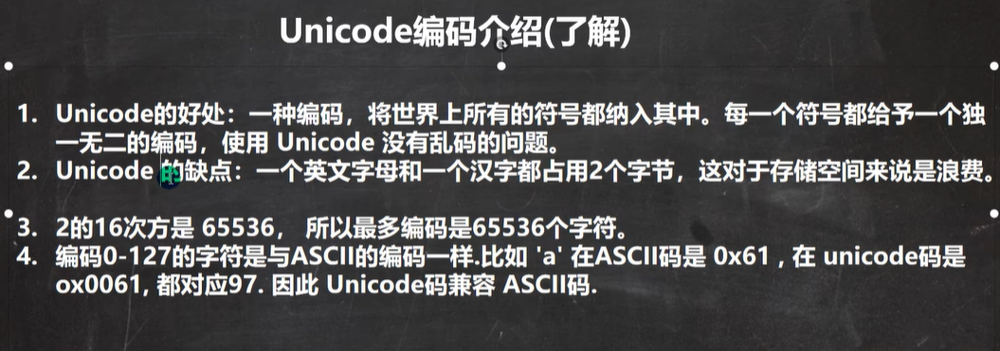
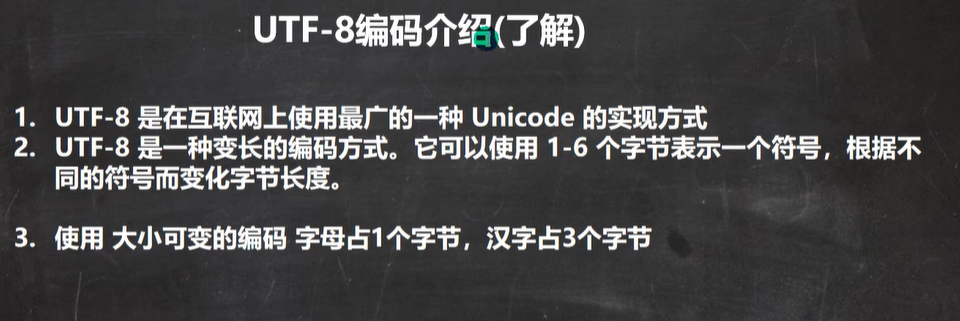
## 布尔boolen
- 01表示是否在java不行
# 类型转换
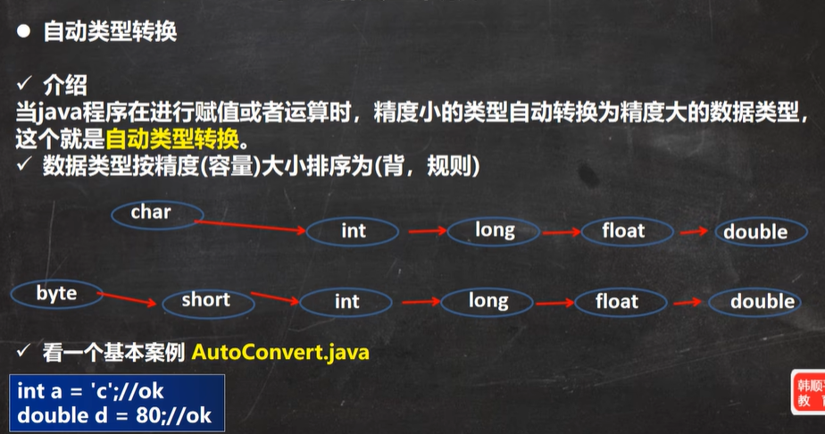 

- 只有int可以和char链接，short byte不行
- 两种赋值：1、直接数值，判断此数在不在数据类型范围内2、变量给变量赋值。看类型能不能转换或适配
- 第四条是转换为int来计算（有个很有趣的，就算两个byte型相加，接受的数据类型应该是int而非byte，short也是）

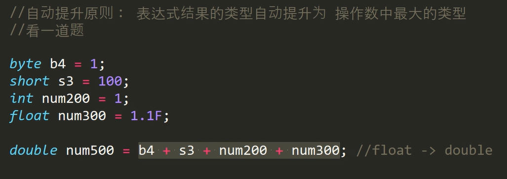
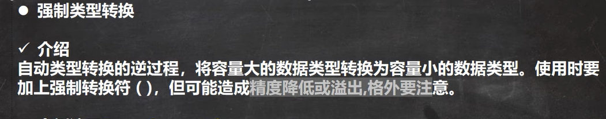
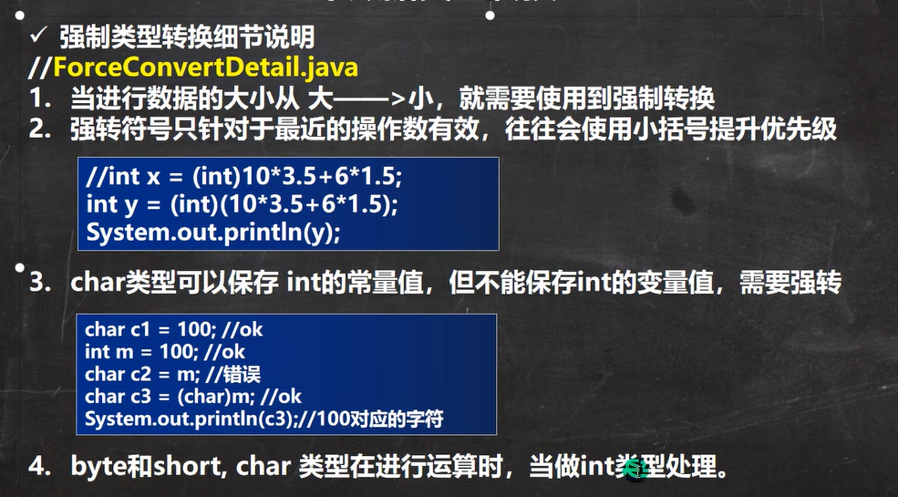
## 特殊：基本数据类型转成string