# 异常
我们实际不可能一报错这个应用就直接崩了
  
## 分类（继承实现关系）
       
       

## 运行时异常

## 编译时异常

# 异常处理
可以理解为，catch try试图解决事情，以免程序崩溃、throw只会丢给上级让他试着try一下，try不了必须再往上throw，往上throw到JMV就程序崩溃
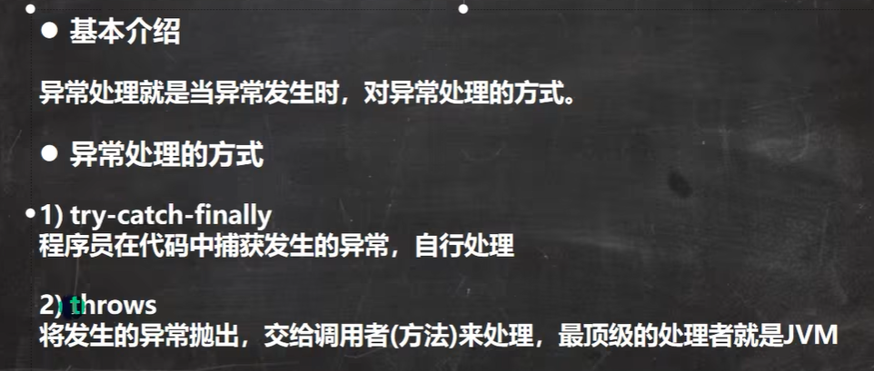
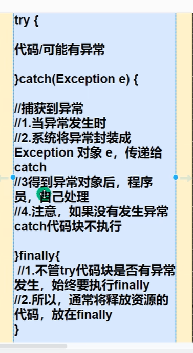
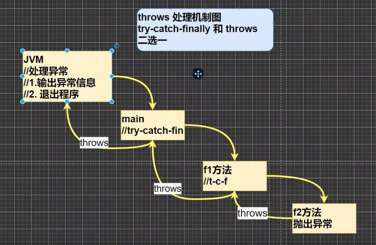
运行异常如果程序员没有显式处理异常默认throw上去。
## trycatch

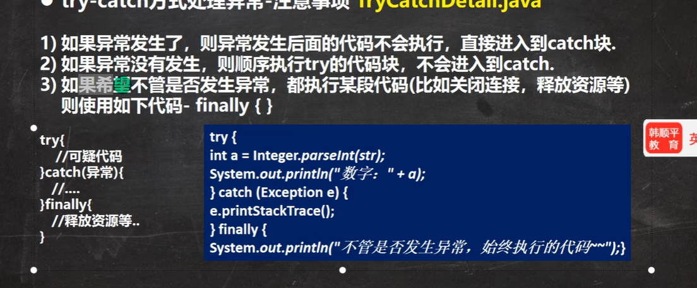
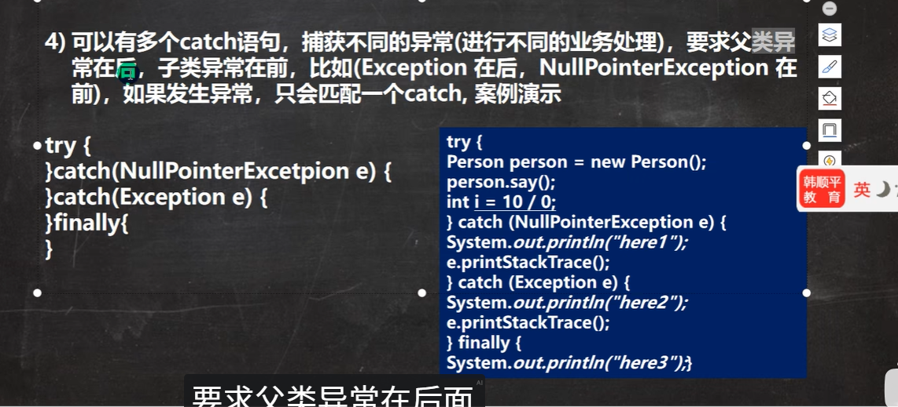
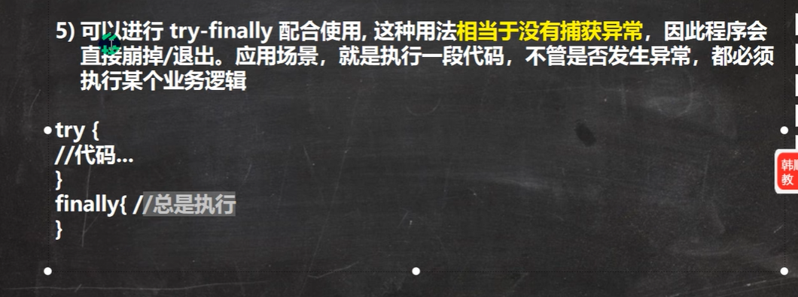
## throw
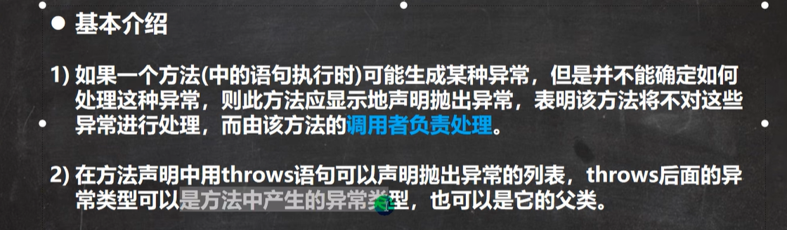
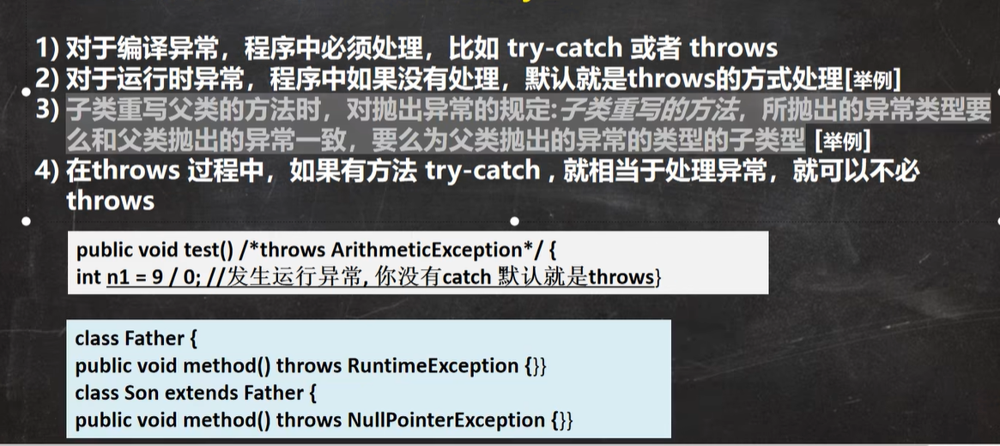
### throws与throw
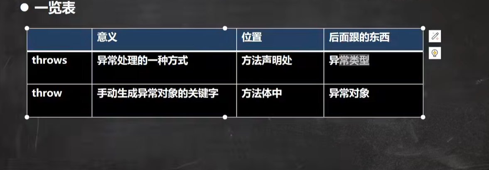
# 自定义异常
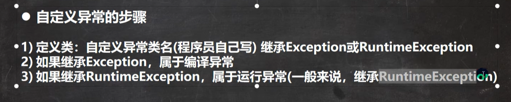
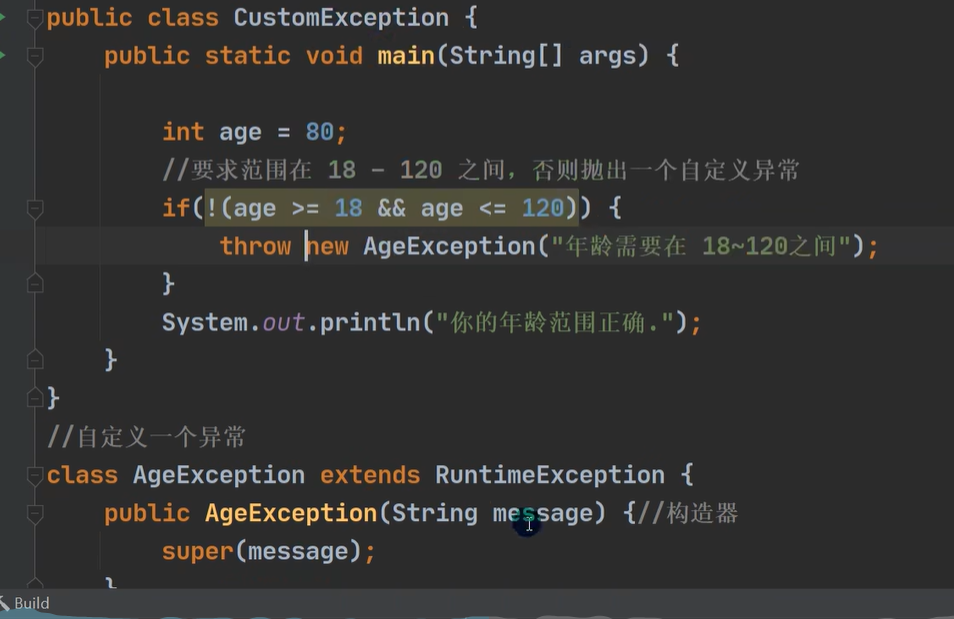
一般自定义时我们都是继承运行异常