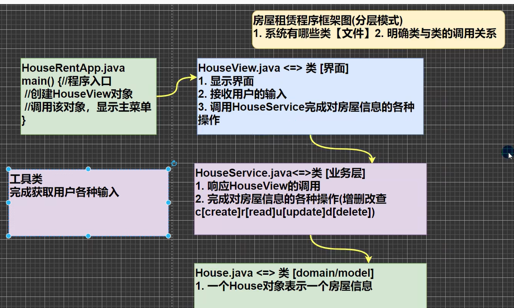

# 思路
先思考总结出需要的所有的类与调用逻辑，完成框架

建不同的包完成包不同类的打包。而工具类utils一般是导入公司的统一工具包或者网上找的工具包。工具包一般是静态方法（static）不需要创建对象就可以调用
- insert+alt可以快捷构建一些常用方法。toString可以在自动构建基础上更改成自己想要的版本。
- 一个类实现一个功能，一个包实现一系列相似功能。比如这个项目中6个子功能的视线跨不同包，实现每个子子功能归类