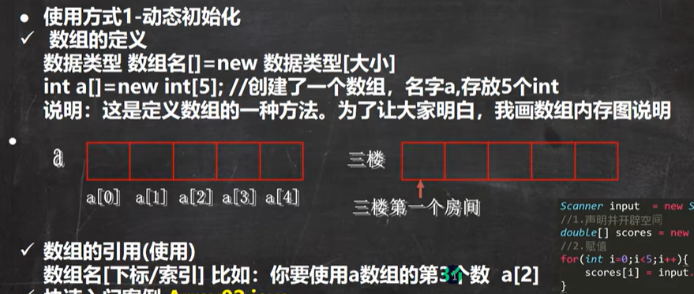
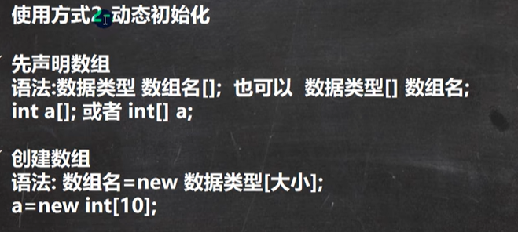
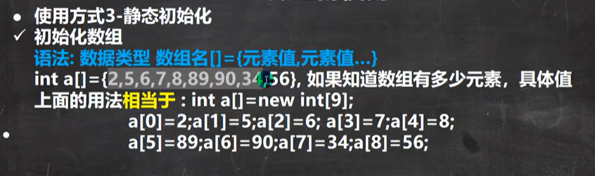
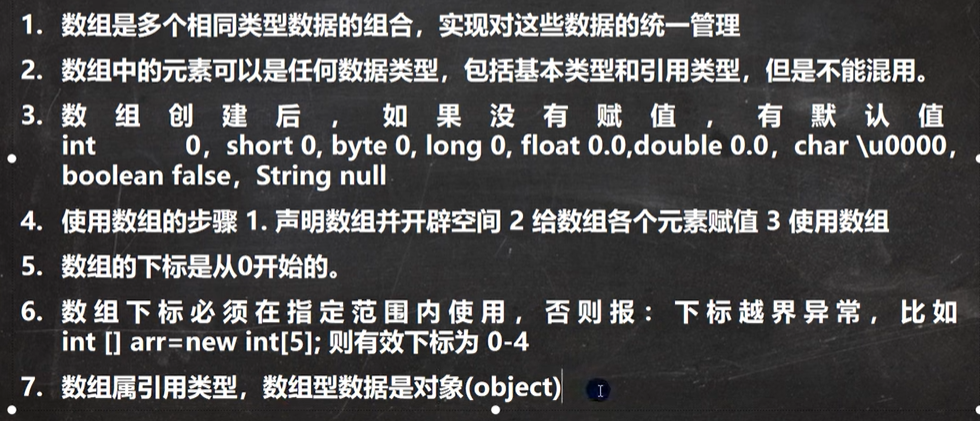
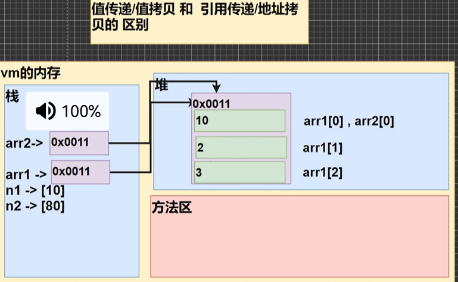
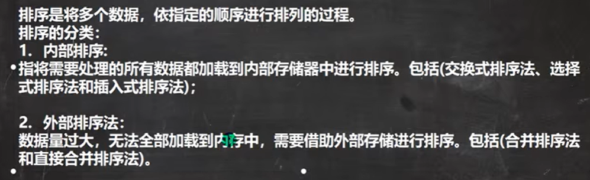
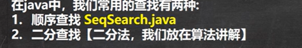
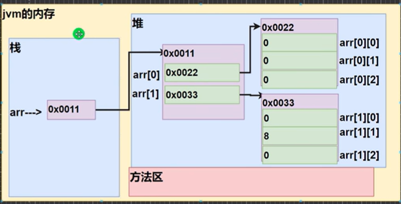

# 数组
## 概念
是一种引用数据类型

同时完成声明和分配内存

分开声明和分配内存

声明内存分配和初始化都一起搞完
## 注意事项

## 数组赋值机制及jvm内存
数组是引用传递，不是值传递

当一个数组去拷贝另一个数组时实际做的是拷贝指针，改变其中的值会影响原数组 
当想要值拷贝应该int [] a2=new int[a1.length];再for循环以此把a1值拷贝进a2中
- 当一个数组拷贝了另一个数组的值（不是地址），原数组不会使用了，可以直接让原数组指向拷贝数组（a1=a2）这样原数组里面的数据无变量指向，会被java自动回收销毁
## 一维数组内存
栈中开辟了一个名为数组名的内存，存放指向堆中一块内存的地址。这个堆中的内存中存放着一维数组的具体值
# 排序
## 分类

## 冒泡排序
n个元素，排序n-1轮，假设这是第i轮，每轮排n-i次
# 查找

顺序查找就是遍历看看相不相等，相等就退出循环。 
字符串用a.equals(b)来比较 
# 数组进阶——二维数组
java中二维数组长度是c++行数，也就是一维数组数。因而a.length是一维数组数，a[n].length是一维数组元素数（必须有n）
## 二维数组创建
int [][]a/int[]a[]/int a[][]都可 
1、int a[][]=new int[m][n] 
2、int a[][];a=new int[m][n]; 
3、int [][]a=new int[m][];a[i]=new int[n];（列数不确定时。java不限制二维里面一维数组每一个长度相等。这个做的就是先声明几列分配地址，再把每列（一维数组）分配你所需的内存） 
以上都是动态初始化 
4、int a[][]={{},{}...}<b>静态初始化
## 内存

java里面数组名指向栈中一块内存，存放一个地址，这个地址指向存放所有一维数组的地址的一块内存（堆中）。而通过这个堆中内存中的一维数组地址，我们找到各个一维数组的内存，那里才存放着所有具体的值