# 枚举
枚举是一种特殊的类，只包含一组有限的限定的对象 
一共两种实现方式，自定义实现和关键字实现
## 自定义
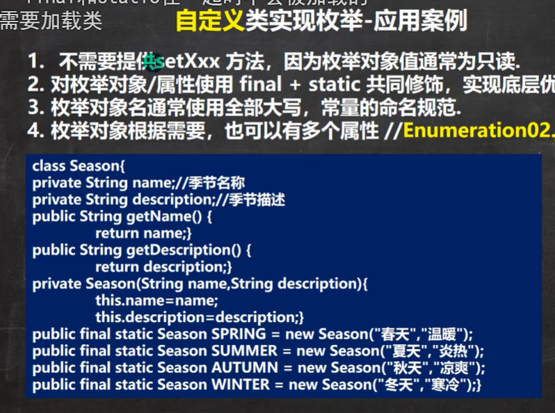
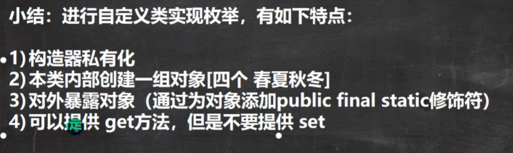
## 关键字（自定义plus）
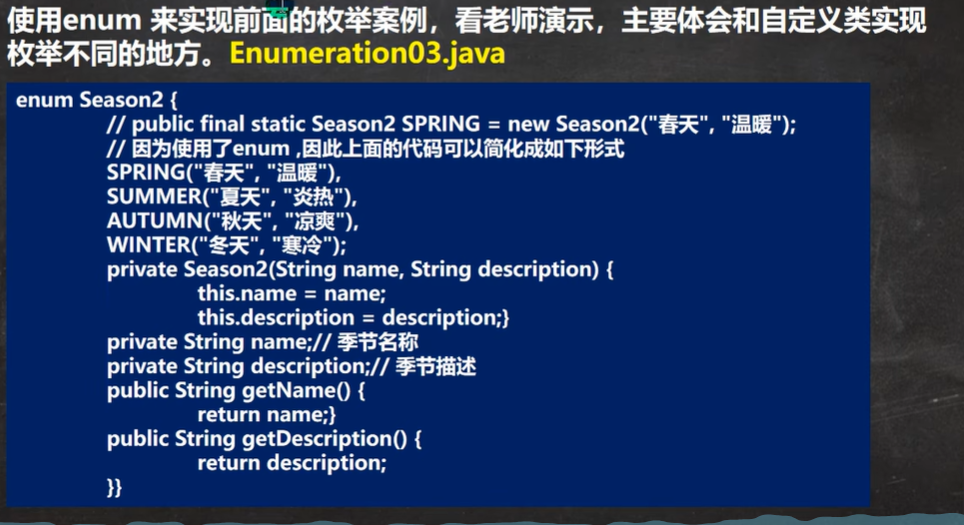 
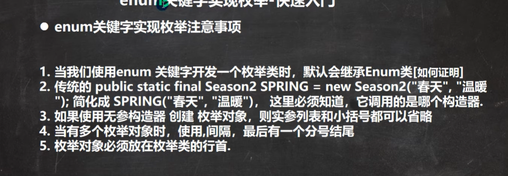
## ENUM成员方法
因为所以枚举的类都是enum类的子类，也就说所有带着enum关键字的类都可以用enum成员方法
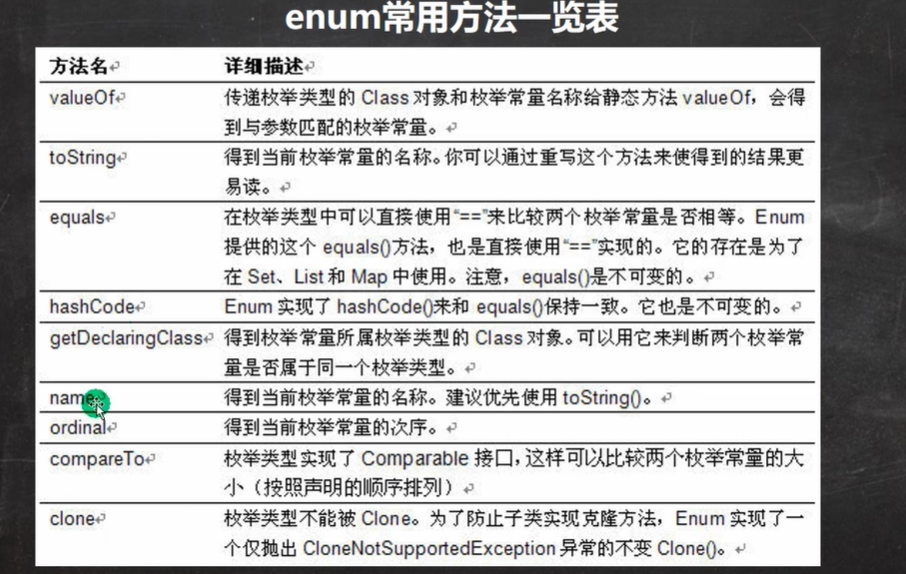
编号是从零开始按照你的定义前后来编号 
values是返回一个枚举的类数组，compare那个是把前者与后者，前-后编号，返回运算值
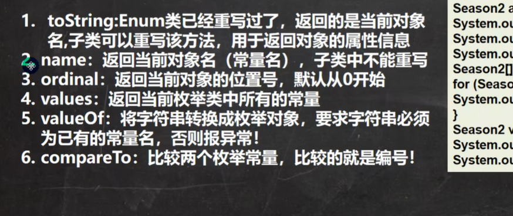
增强for循环
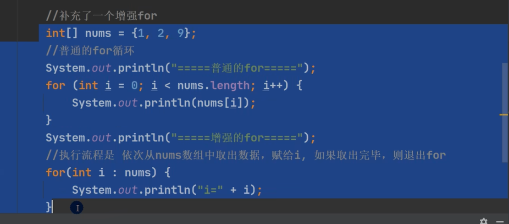
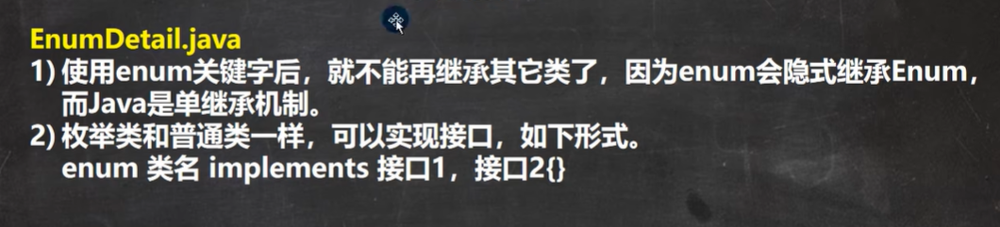
# 注解
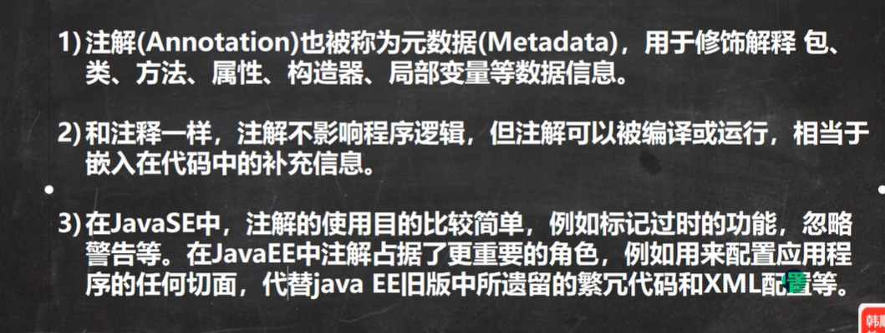
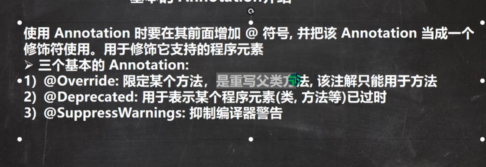
## override
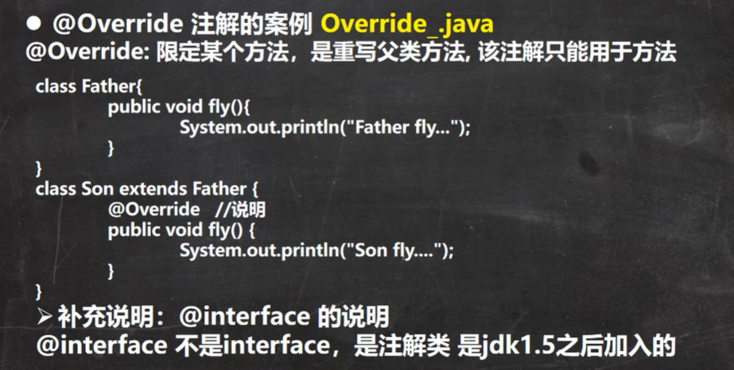
会检查你这个方法是否真的重写，若无编译会报错
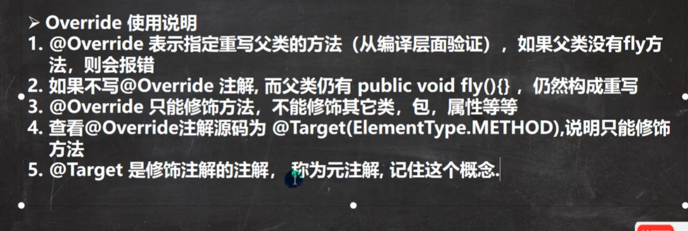
## deprecated
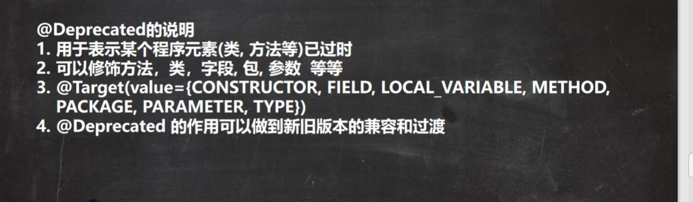
## suppresswarnings
（{}）里面“值”，可以屏蔽的值如下
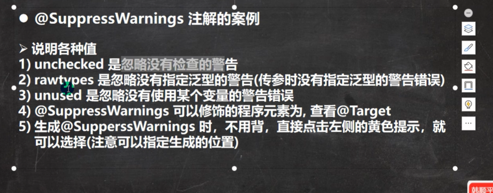
## 元注解
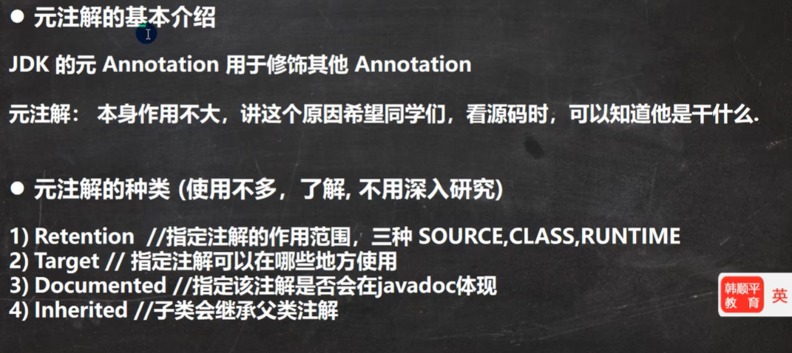
用的时候自己查，懒得学！！！！