# 泛型
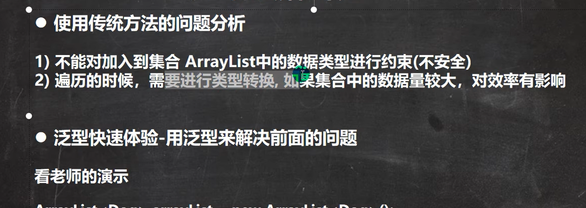
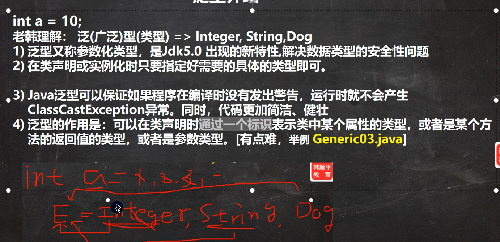
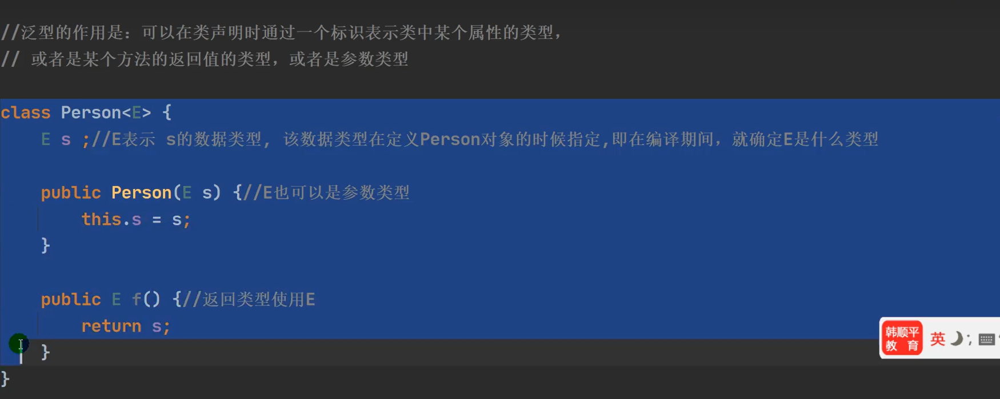
当实例化：Person<String> person = new person<string>("xx"); 
就相当于把上面代码所有的E换成了String，当输入不对的类型会报错，起到一个限制类型的作用
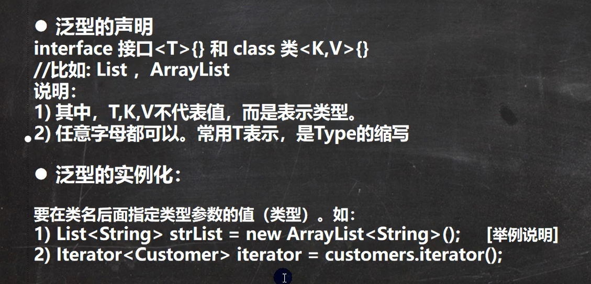
 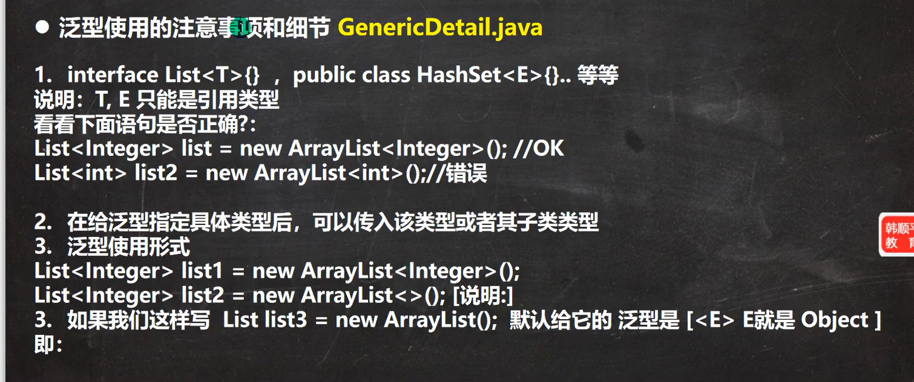
 ## 自定义泛型
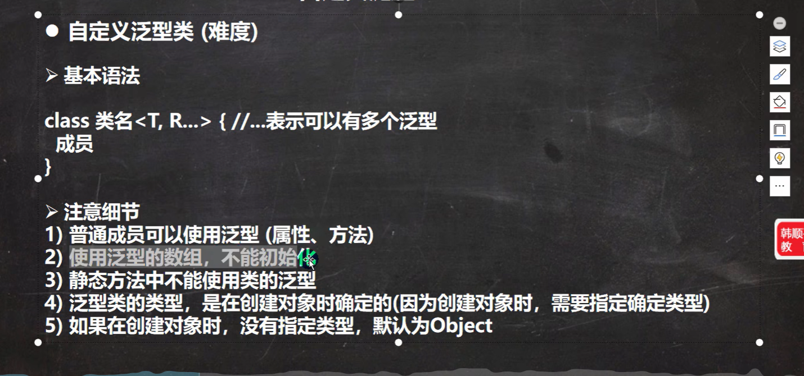
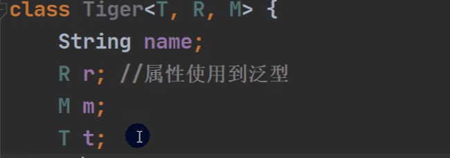
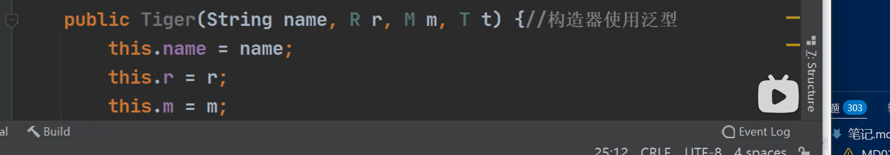
这里xx可以使用泛型就是指xx中的数据类型可以用泛型占位后面进行替换。 
静态不可以是因为静态是与类加载有关，而泛型与对象创建有关。顺序冲突
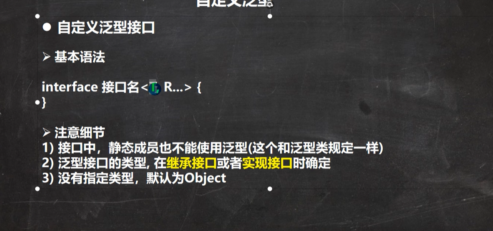
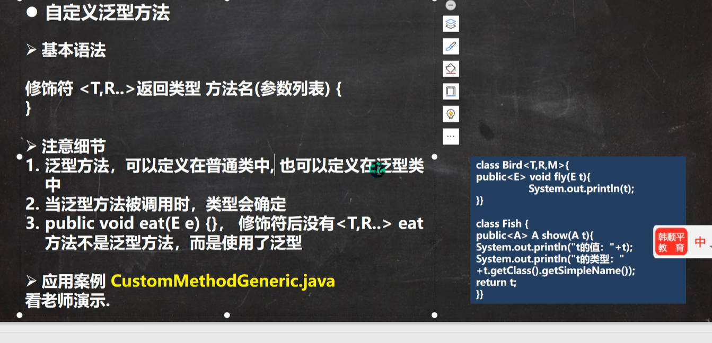
## 泛型的继承和分配符
也就是不能向上转型运用多态
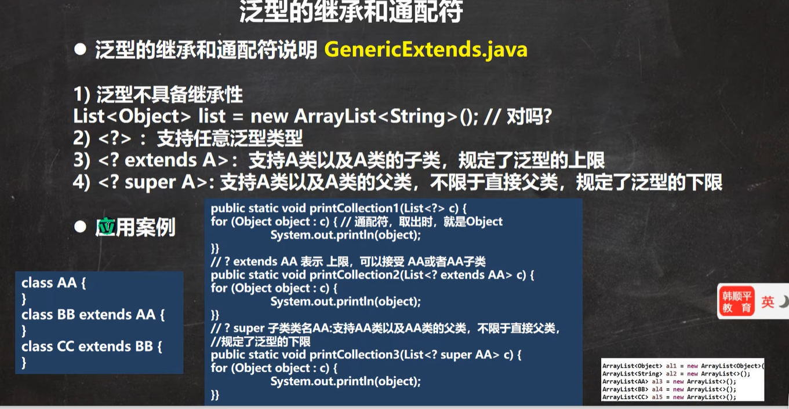
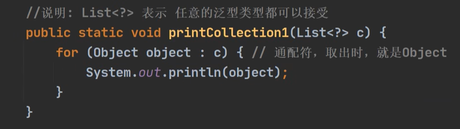

这里？就是起到适配任何<xx>的list数据。同时？在企业开发也可以用？表示这里需要运用泛型，起到提醒作用。而？ extend AA,这种格式表示这里泛型可以是AA及其子类，限制了一定的范围。？ super AA则表示AA及其父类
# Junit
java提供的单独测试方法的功能模块，避免了main方法测试需要反复注释掉其他模块的问题。 
@Test后用alt加enter配置后右键方法可以直接run这个方法
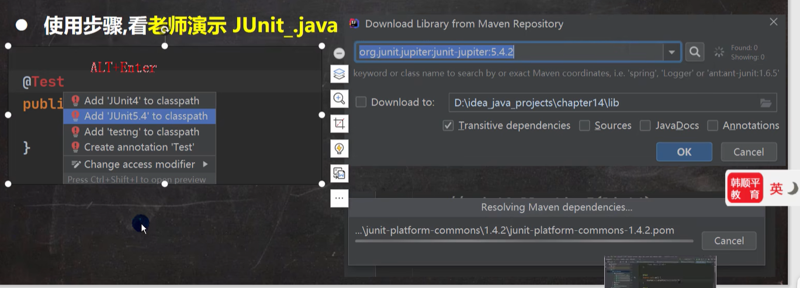