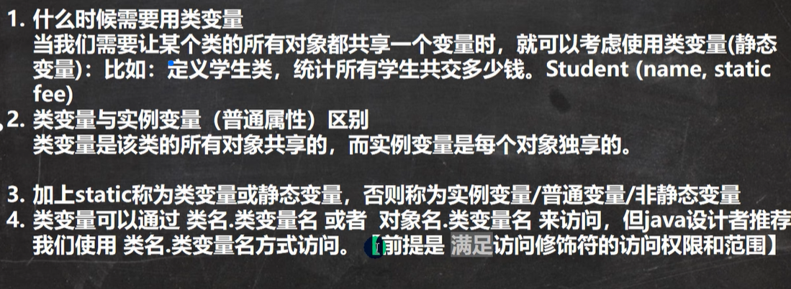
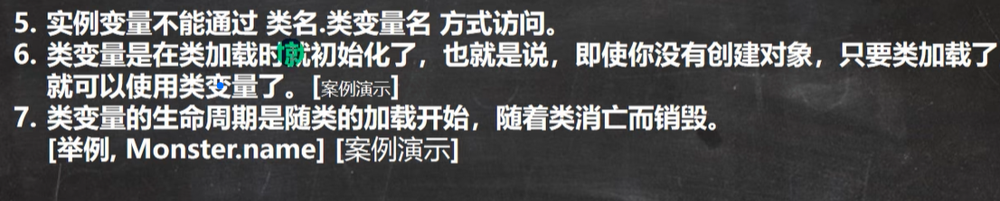
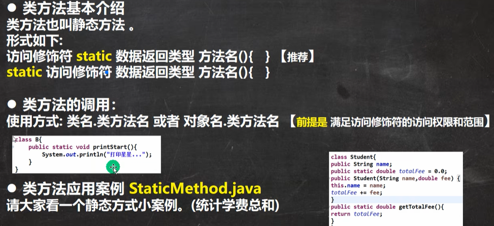
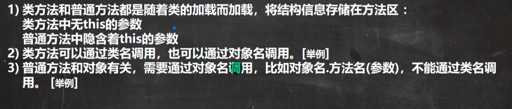
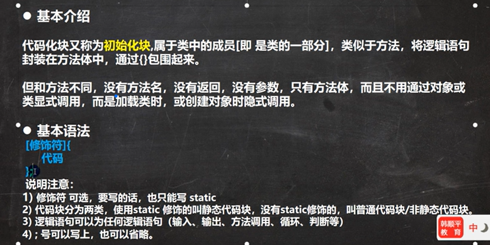
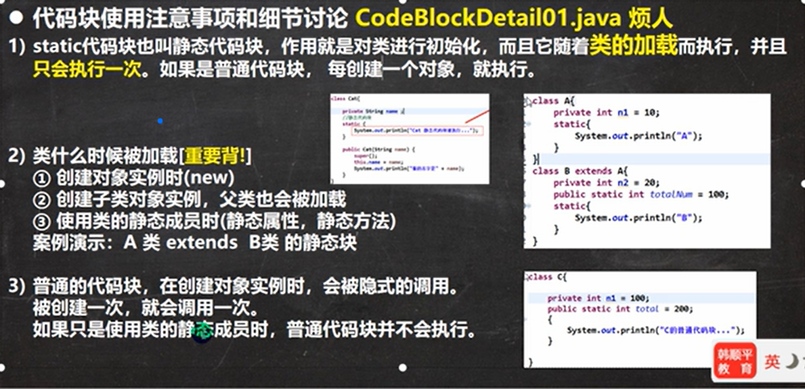
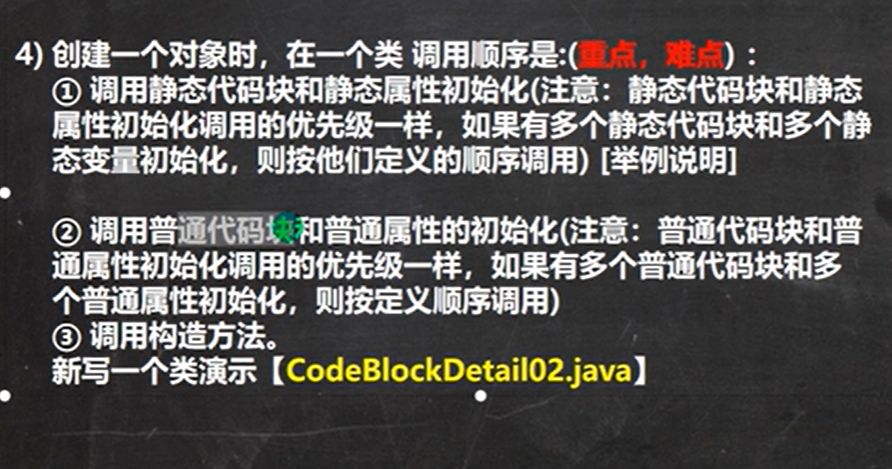
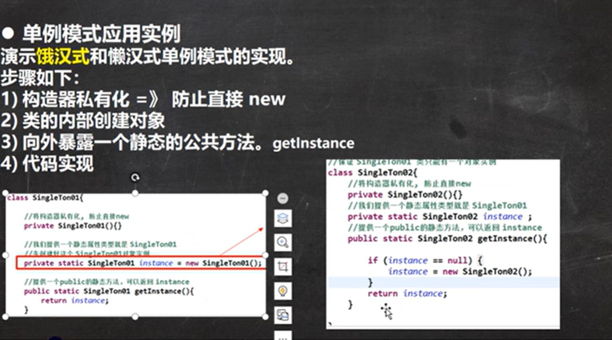

# 类变量(静态变量)
此类所有对象共享的一个变量，在类加载随着类的加载而创建，也就是没有创建对象也会存在类变量

## 细节

# 类方法

## 注意事项

# main方法

注意哦，这里说的静态变量非静态变量是在publc static void main(){}与上面那一坨中间，就是类比普通的类的形式，属性和方法该在的地方。
## idea中使用args数组方法

Program arguments的地方
# 代码块

相当于另一种形式的构造器，解决了构造器中代码复用问题
## 细节

注意继承中static类加载规则父类先加载（代码块先运行），后子类 
而普通代码块可以看做是构造器的延展。构造器被调用，一定代码块就会被调用

若类中代码块在下，方法在上输出会前后颠倒。这就是顺序 
而总体上静态>普通>构造器。也就是先加载类再创建对象。创建对象要从属性方法代码块初始化开始，到构造器（遇见了父类就套娃，而构造器暗中包括super构造器和普通代码块的调用）

# 单例设计模式

## 饿汉式
无论有没有使用在一开始类被加载就已经创建这个对象，就可能造成资源浪费

下面是代码

## 懒汉式
