# 绘图
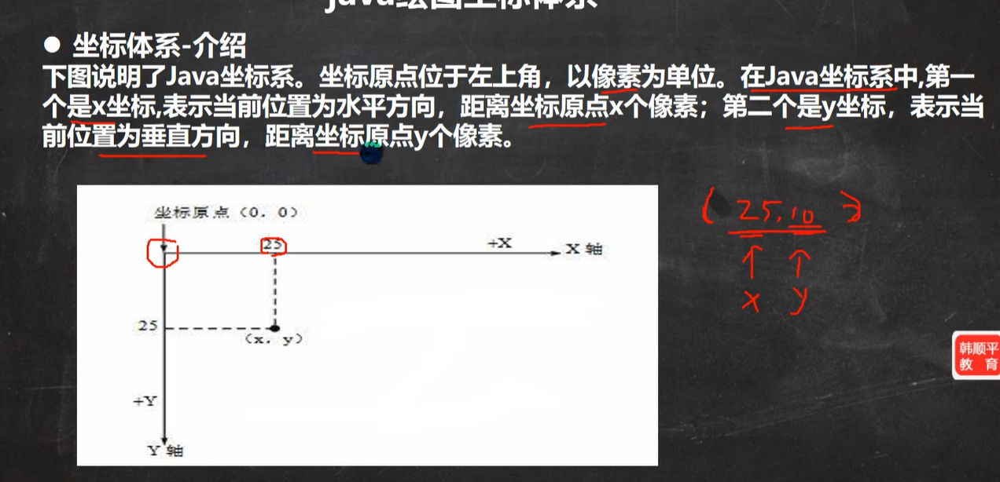
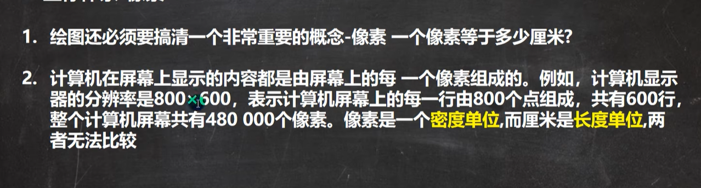
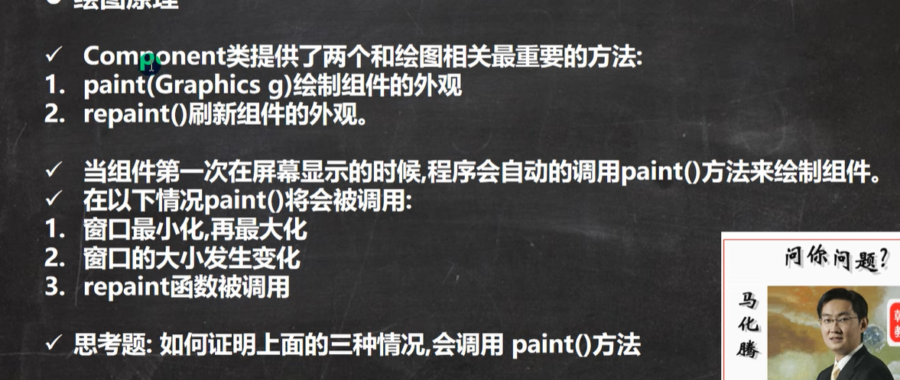
## 绘图基本代码
模版
```
public class Draw extends JFrame{
private MyPanel mp = null;
public static void main(String[]args){
    new Draw();
    
} 
public Draw (){//构造函数
    mp=new MyPanel();
    //初始化面板
    this.add(mp);
    //把面板放入窗口
    this.setSize(400,300);
    //窗口大小设置
    this.setDefaultCloseOperation(JFrame.EXIT_ON_CLOSE);
    //窗口点x就可以关闭
    this.setVisible(true);
    //可以显示
}
}
class MyPanel extends JPanel{
    //1.MyPanel对象就是一个画板
    //2.Graphicsg把g理解成一支画笔
    //3.Graphics提供了很多绘图的方法
    public void paint(Graphics g){//绘图方法
    super.paint(g);//调用父类的方法完成初始化.
    g.drawOval(10,10,100,100);//绘制椭圆
    //绘图函数调用在这里，上面都是一样的代码，绘制不同事物只需要修改这里的代码就可以了
}
}
```
## Graphics类
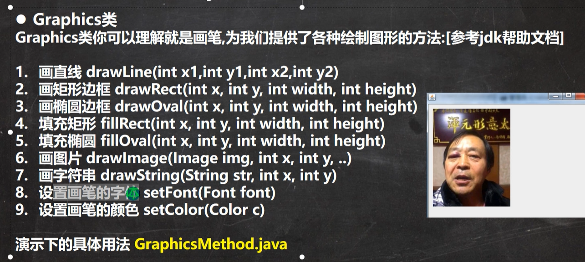
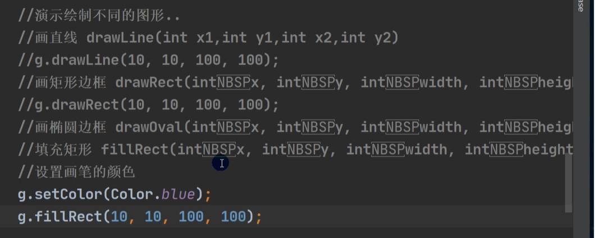
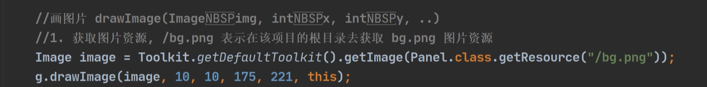
这里图片资源存放地址与getSourse后面的字符相关。ai推荐是放在src文件的根目录下，后面地址相同，/xxxx。
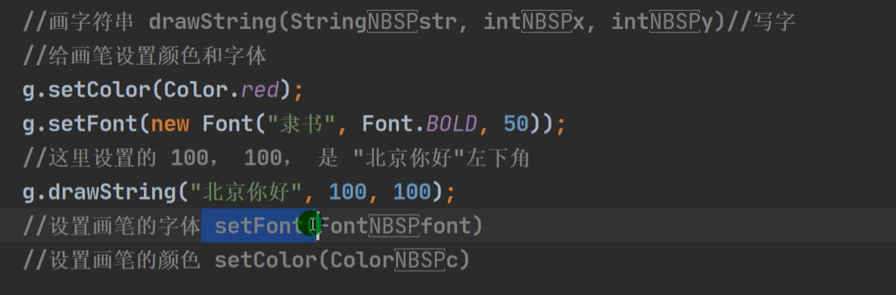
# 事件处理机制
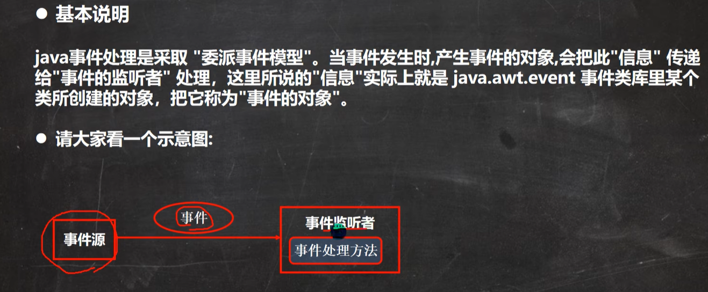
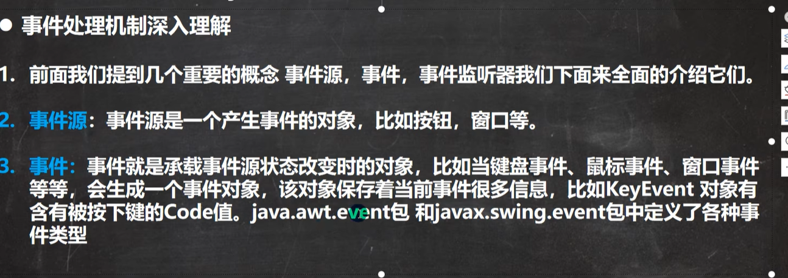
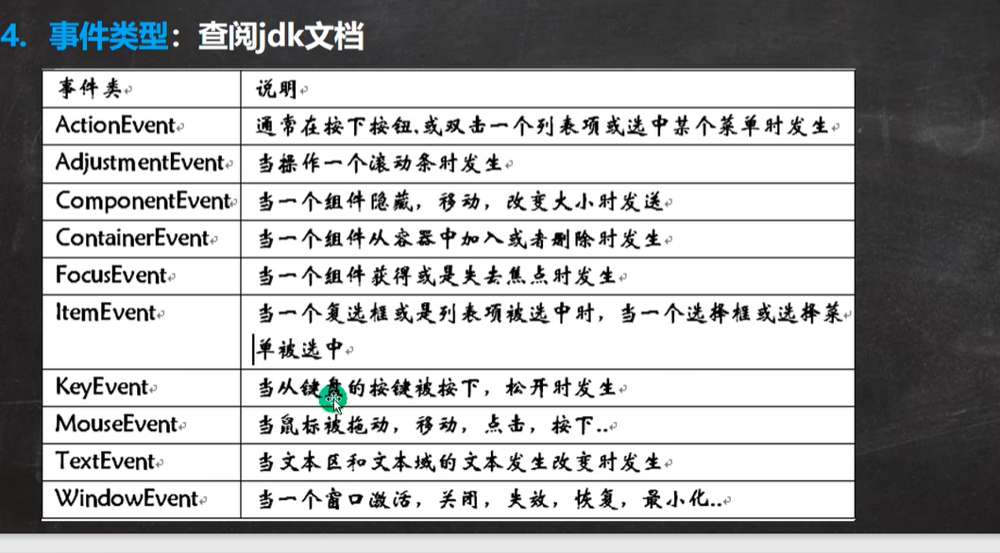
利用这个，我们可以监听键盘，然后操控我们的小球在画板上移动。<br>
我们让我们的画板(mp)继承监听器接口（KeyListener），然后调用keyPress方法。以下是该监听器的三种方法
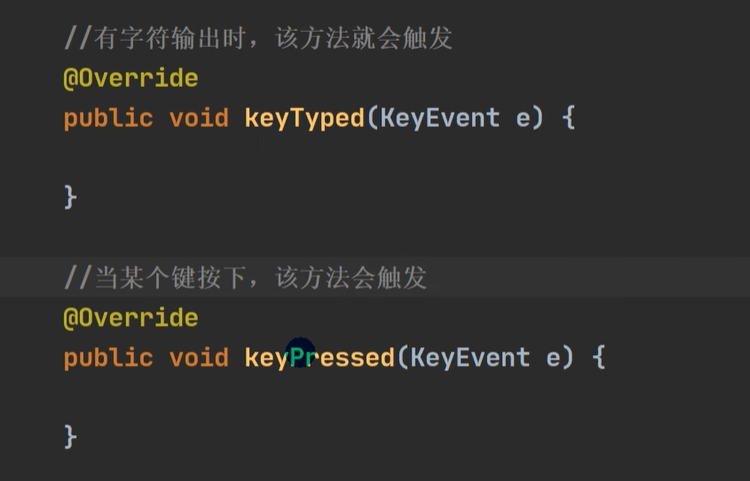
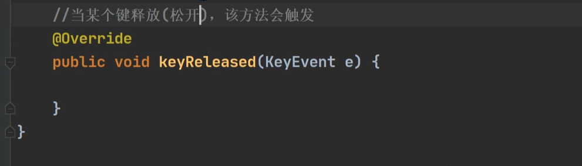
然后我们需要注册一个监听器才能使用监听功能。利用addKeyListener(mp)，这里传入参数应该是keylistener类型。但是因为我们画板类已经实现了，所以导入OK
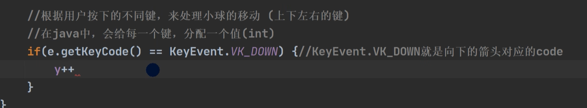
然后重写方法。记得重绘