# 算数运算符
- 基本和c/c++一样，需要注意的的是java在面对double=2.0/1这样的不会像c那样后面也加6个零或c++那样直接变成2，而是直接变成2.0。
- %本质：a%b = a - (a / b) * b
- 注意，如果%里面有小数a%b = a - （int）(a / b) * b
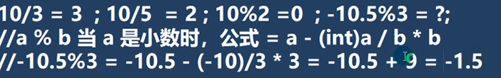
# 关系（关系）运算符
intanceof: 用于判断一个对象是否是一个类的实例，返回boolean值。
# 逻辑运算符
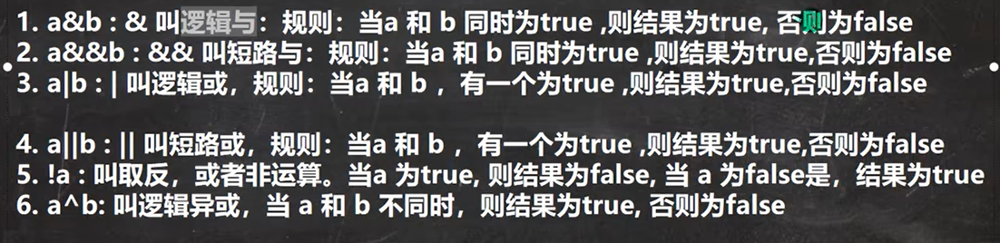
- 短路系列涉及短路问题：&&前一个否后一个不会运算，||前一个真后一个不运算
# 赋值运算符
运算顺序等等一致。但有一点复合赋值运算符会自己类型转换。比如：byte b+=2 这里会自动把2转成byte类型，而不是int类型。
# 三元运算符
- tip：三元运算符的式子要能够赋给一个变量或者满足可以自动转换
# 运算符优先级
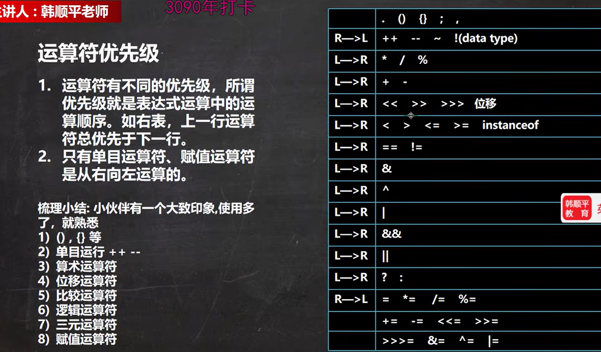
# 标识符命名规则
和c/c++类似，但java首个可_，特殊字符仅$_
# 标识符命名规范
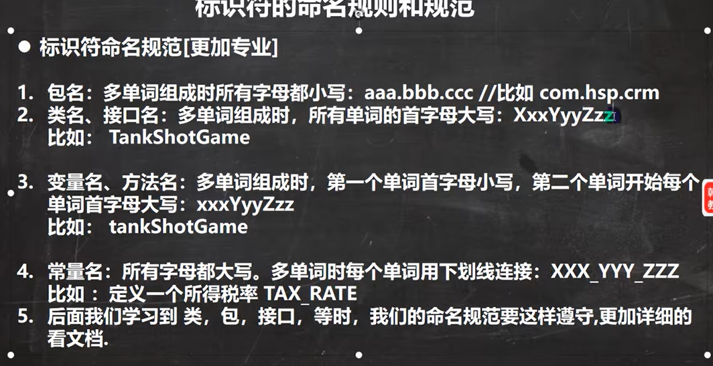
# 键盘输入语句
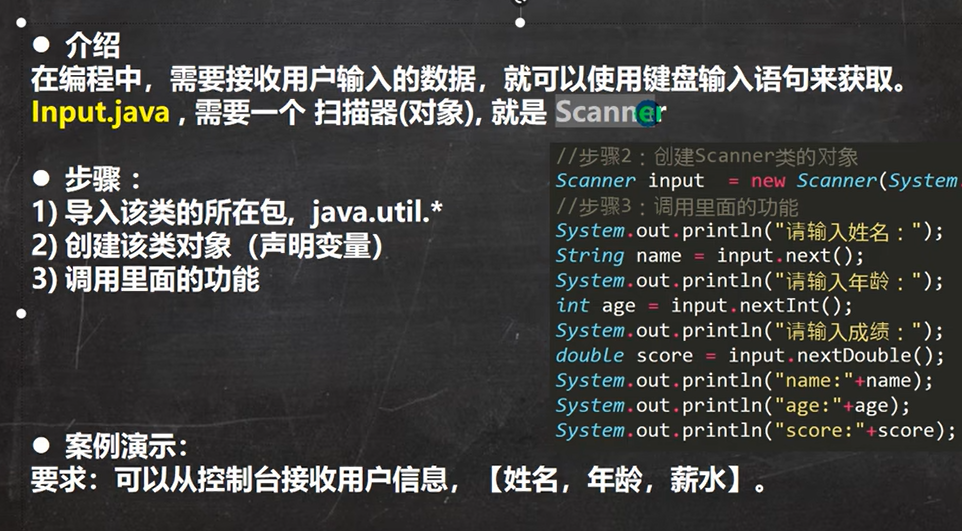
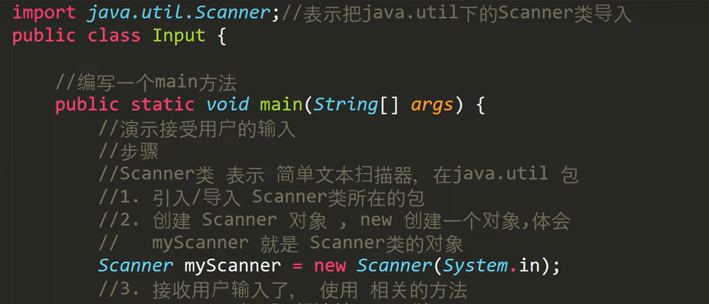
需要引入包和其下的类，再new此类一个对象。和next为此类一个方法
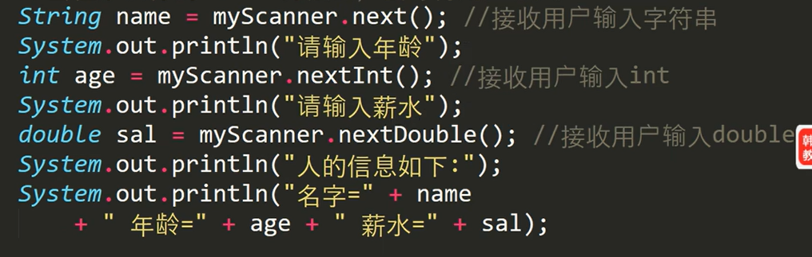
为标记输入的文本为不同数据类型需要不同next方法
# 进制
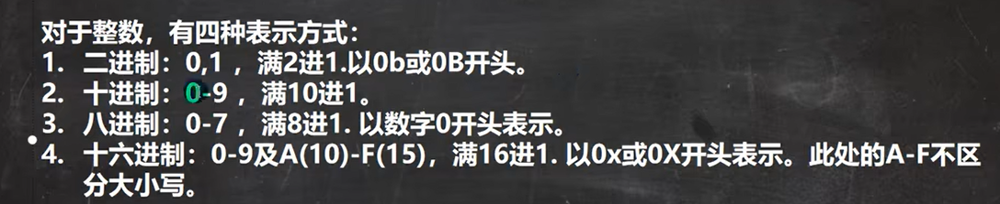
二进制：0B 
八进制：0 
十六进制：0x
## 二转八
每三位转十进制就是八进制的数，比如101——5
## 二转十六
每四位转十进制就是十六进制数
## 八转二
十六进制数的每一位当做一个十进制的数字转三位二进制数组
## 十六转二
一转四，类上
# 原码反码补码
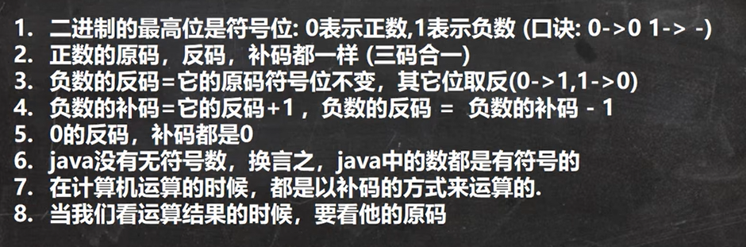
# 位运算
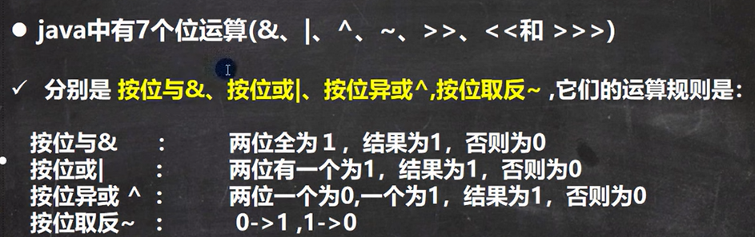
- 两数按照补码运算，并在补码上每位进行位运算

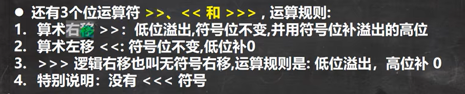