# 类与对象
## 基本概念
和c++那一套一样。<br>
属性=成员变量=字段
## 内存
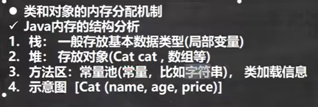
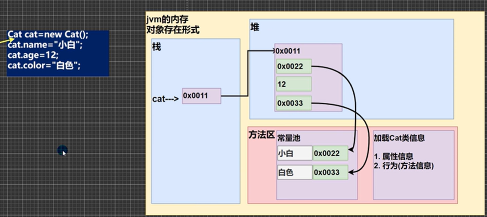
在执行类的实例前，他会先进行加载，将类的属性信息和方法信息加载，以识别分配不同内存。<br>
类和数组一样，栈存放的只是一个地址。而根据数据类型的不同，引用数据类型和基本数据类型会放在不同内存区：<br>
引用（如string）在堆留下一个指向存在方法区的值的地址，真正的值（字面量）存在方法区的常量池。而基本数据类型就直接值存在堆。<br>
图中cat是对象引用/对象名，真正的对象是堆及方法区的东西
## 注意事项
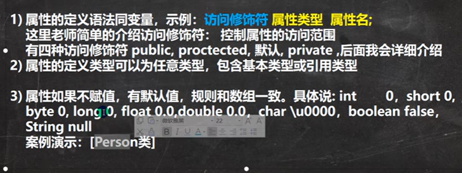
- 数组默认规则是：0,null,0.0,false
## 创建
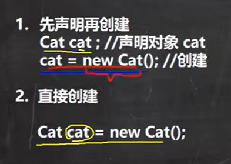
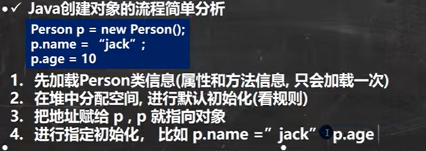
## 访问
也是.访问
# 方法
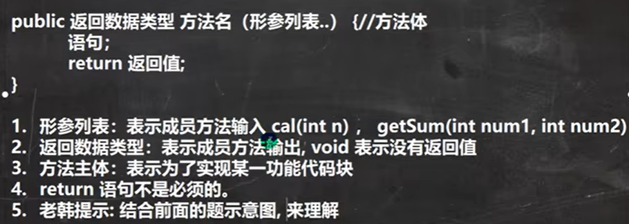
## 调用机理
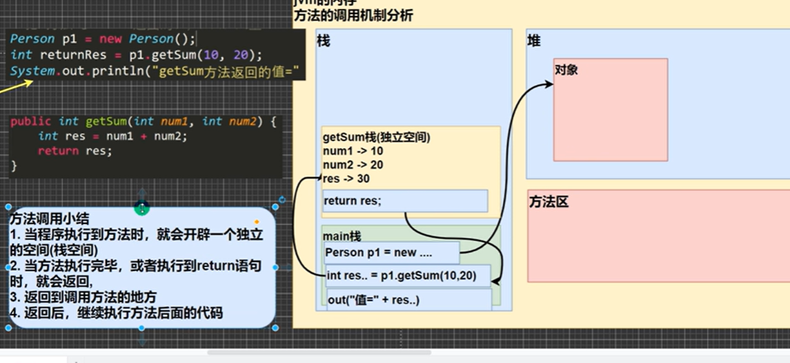
## 注意事项
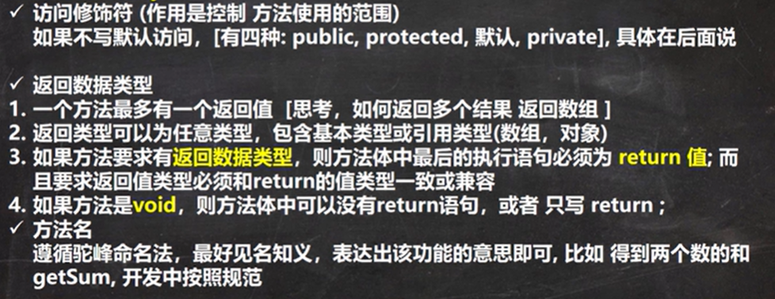
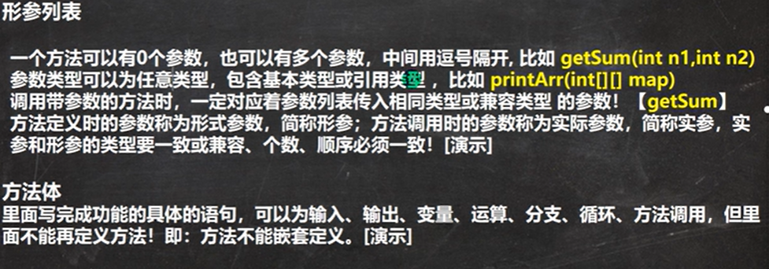
这两张图没什么可说的，不看都行，和c/c++一样<br>
接下来是类方法的嵌套调用
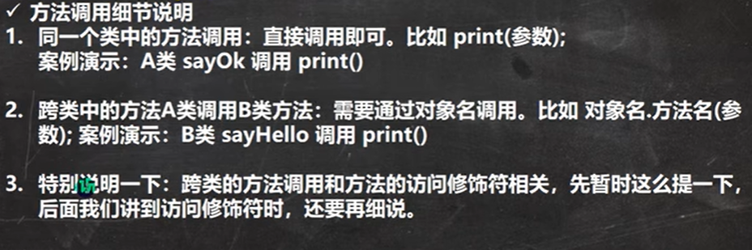
## 方法传参方式
也是分为值传递地址传递<br>
基本数据类型，传递的是值（值拷贝），形参的改变不改变实参<br>
引用数据类型，比如数组，传递的是地址。在传递参数时，数组名拷贝进了方法开的栈空间内。但与基本数据类型不同的，我们知道引用数据类型变量名指向的是一串地址，这个地址所在的内存空间才是值。因而我们调用方法后对参操作实际是对堆中数据操作，而不是方法栈中的，就算方法栈调用后销毁也无碍
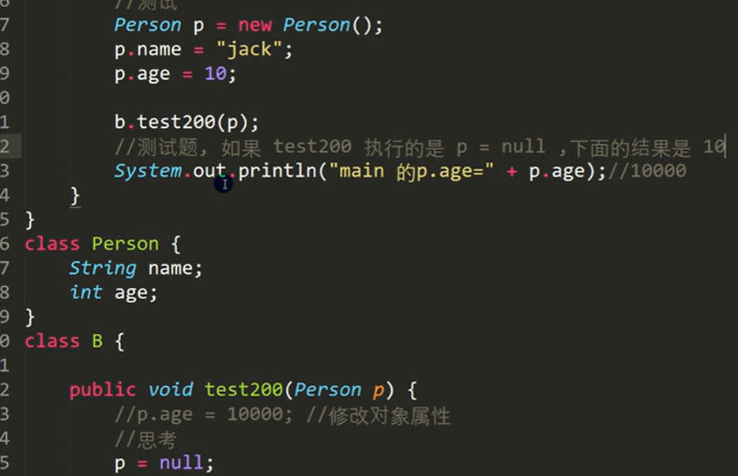
例题：这里输出是10。在调用方法时也创建了一个新变量p，指向main中person p数据。因而才实现了影响实参。这里p=null只是使临时的变量p指向空而已，
# 方法的递归调用
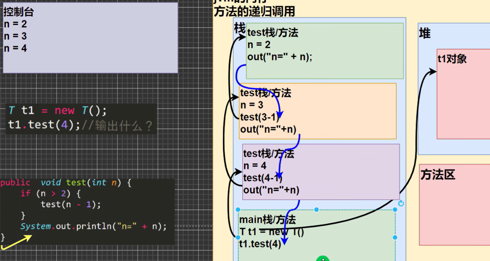
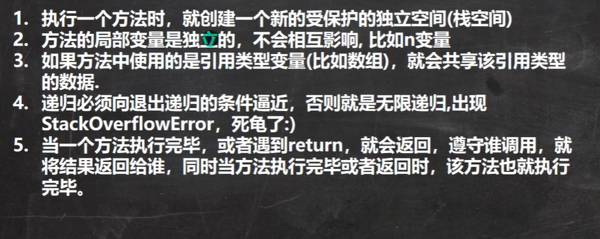
## 例题：走迷宫
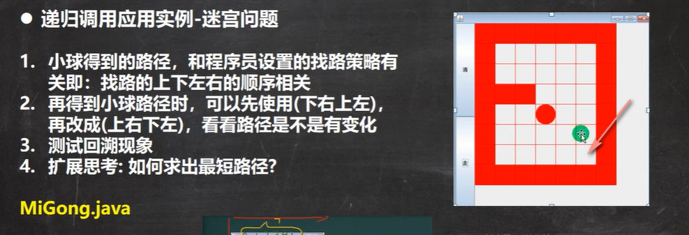
```
public class Main { // 类名通常首字母大写
    public static void main(String[] args) {
        // 1. 初始化地图
        int[][] map = new int[8][7];

        // 2. 设置上下墙壁
        for (int i = 0; i < 7; i++) {
            map[0][i] = 1;
            map[7][i] = 1;
        }
        // 3. 设置左右墙壁
        for (int i = 0; i < 8; i++) {
            map[i][0] = 1;
            map[i][6] = 1;
        }

        // 4. 设置障碍物
        map[3][1] = 1;
        map[3][2] = 1;

        // 5. 开始找路
        // 因为 f 方法写在下面并且是 static 的，所以可以直接调用
        // 从 (1,1) 开始找
        boolean r = f(map, 1, 1);

        if (r) {
            System.out.println("=== 迷宫路径如下 ===");
            for (int i = 0; i < 8; i++) {
                for (int j = 0; j < 7; j++) {
                    System.out.print(map[i][j] + " "); // 使用 print 不换行
                }
                System.out.println(); // 每一行输完后换行
            }
        } else {
            System.out.println("没有找到路！");
        }
    }

    // 0代表无障碍物 1有障碍物 2可以走 3死路
    // 加上 static 方便 main 方法直接调用
    public static boolean f(int[][] map, int i, int j) {
        
        // 1. 终点判断：如果终点已经变为2，说明找到了
        // 假设终点在 (6, 5)
        if (map[6][5] == 2) {
            return true;
        } else {
            // 2. 当前位置检查
            if (map[i][j] == 0) { // 如果这里没走过
                
                map[i][j] = 2; // 假定能走通，先标记为2

                // 3. 找路策略：下 -> 右 -> 上 -> 左
                // 注意：这里传参是 map, i+1, j
                if (f(map, i + 1, j)) {
                    return true;
                } else if (f(map, i, j + 1)) {
                    return true;
                } else if (f(map, i - 1, j)) {
                    return true;
                } else if (f(map, i, j - 1)) {
                    return true;
                } else {
                    // 四面都不通，回溯！
                    map[i][j] = 3;
                    return false;
                }
            } else {
                // 如果是 1(墙), 2(已走过), 3(死路)
                return false;
            }
        }
    }
}
```
## 例题：汉诺塔
无论几阶的汉诺塔都看做两层：最下面一层和上面其余层。那么这两层移动其实就三步：1、堆柱->辅助柱2、堆柱->目标柱3、辅助柱->目标柱
```
public void move(int num, char a, char b, char c) {
    // a: 起始柱(Source), b: 辅助柱(Aux), c: 目标柱(Target)
    
    if (num == 1) {
        System.out.println(a + " -> " + c);
    } else {
       
        move(num - 1, a, c, b); 

    
        System.out.println(a + " -> " + c); 

        move(num - 1, b, a, c); 
    }
}
```
## 例题：八皇后
暂且放过自己，先不学呢
# 方法的重载
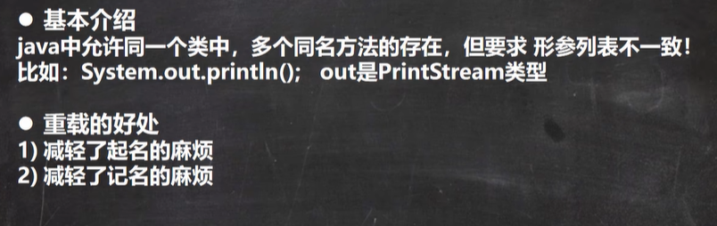
## 注意事项
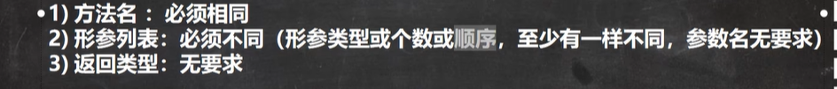
也就是说只有形参列表，且只是类型影响重载现象，这里自动类型转换也可以，但匹配时优先不自动转型的那个
# 可变参数
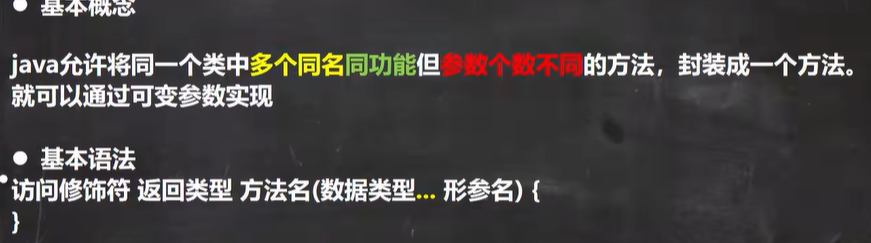
比如：public void s(int... nums)<br>

## 注意事项
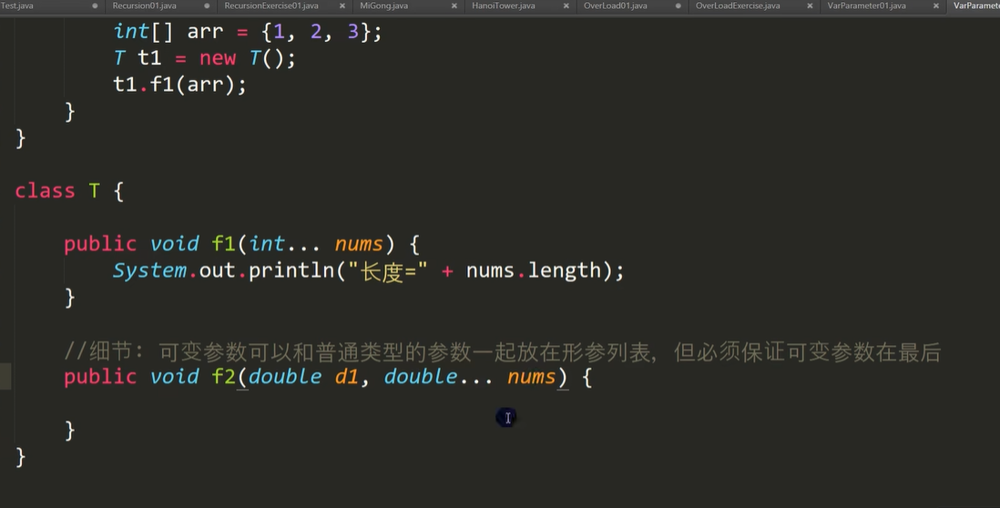
本质是数组，因而可以nums.length。当实参传递一个数组，但形参类型是int，那么是把数组里面的值挨个int型录入
# 作用域
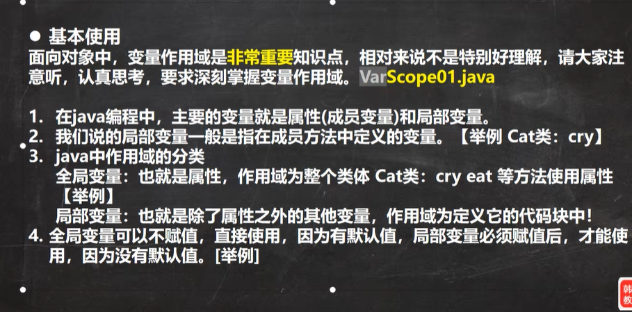
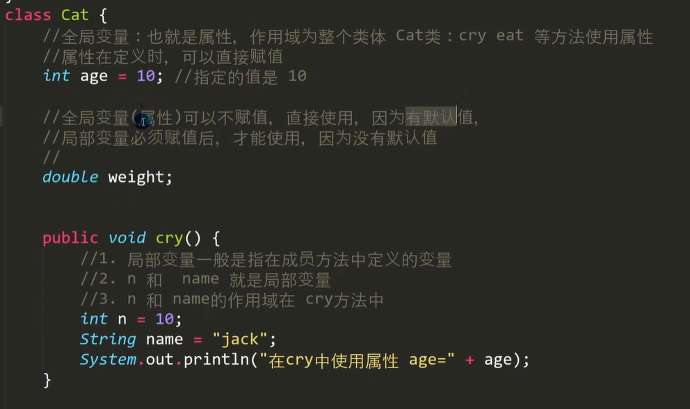
- 和c/c++一样，局部变量和全局变量，优先采用局部变量的
- 全局变量可以加修饰符，局部不可以
# 构造方法/构造器

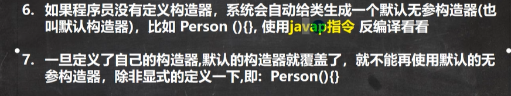
修饰符不用加[]！！！！<br>
构造器具有重构现象
##  使用构造器的对象创建流程
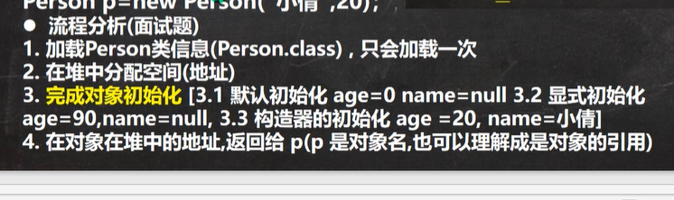
# this
哪个对象调用，this就指向哪个对象堆中地址。可以把它当做对象名的等效替换，类对象名的使用，this.属性/方法 来访问
## 图解理解
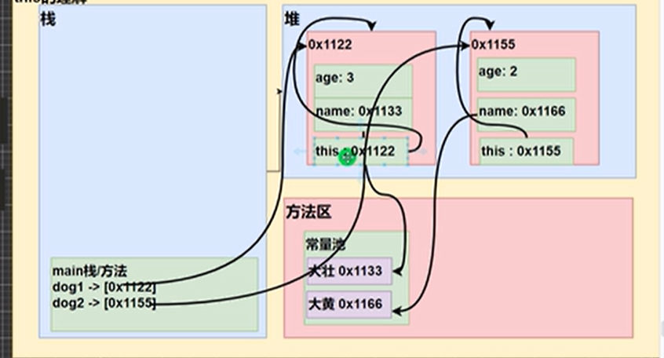
## 注意事项
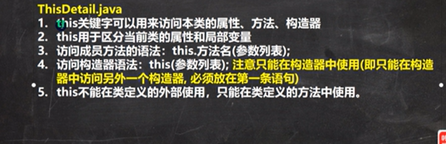
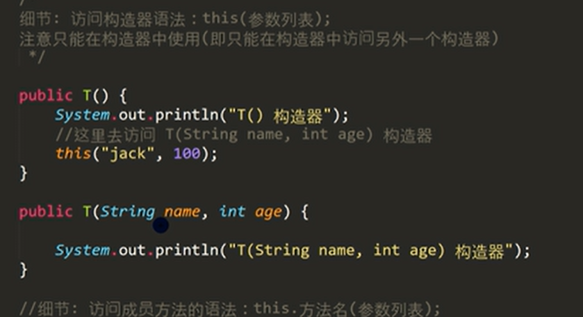