# 类变量(静态变量)
此类所有对象共享的一个变量，在类加载随着类的加载而创建，也就是没有创建对象也会存在类变量
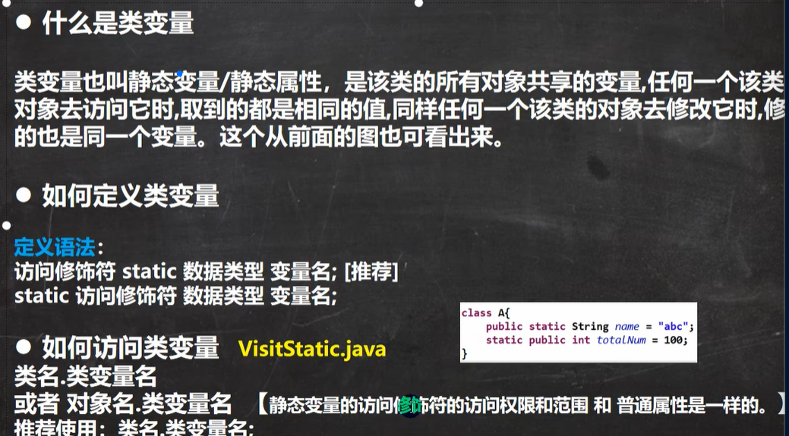
## 细节


# 类方法

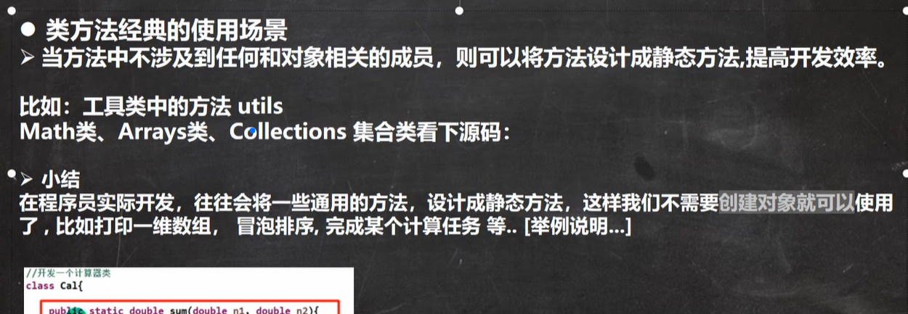
## 注意事项


# main方法
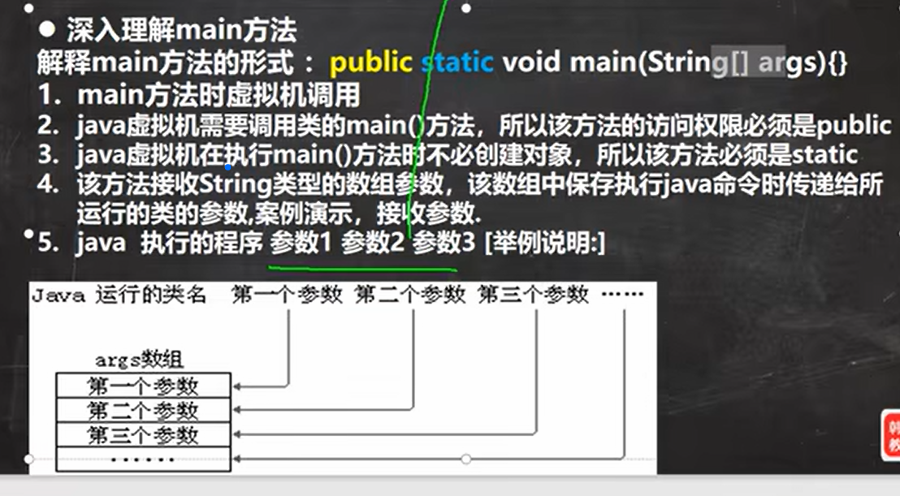

注意哦，这里说的静态变量非静态变量是在publc static void main(){}与上面那一坨中间，就是类比普通的类的形式，属性和方法该在的地方。
## idea中使用args数组方法
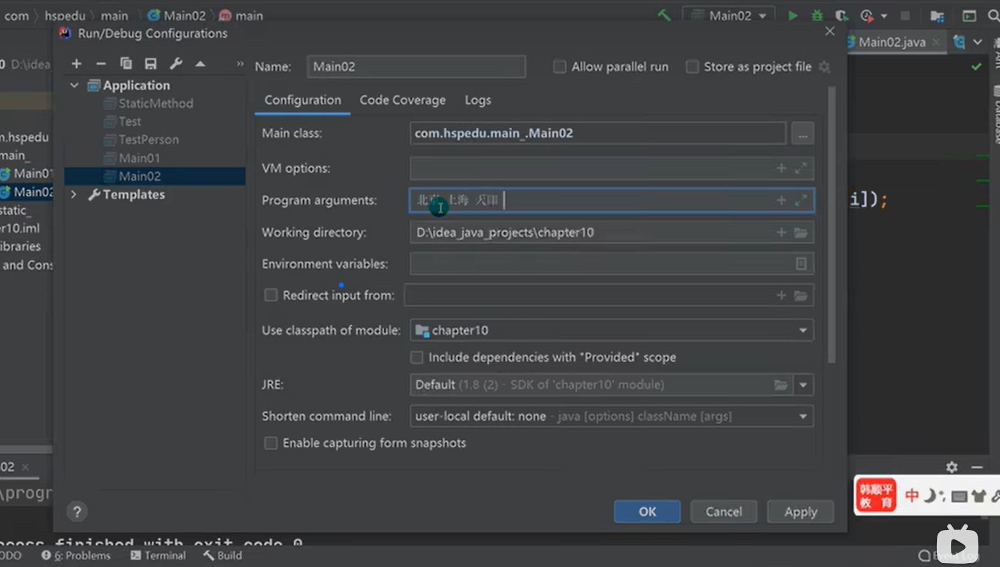
Program arguments的地方
# 代码块

相当于另一种形式的构造器，解决了构造器中代码复用问题
## 细节

注意继承中static类加载规则父类先加载（代码块先运行），后子类<br>
而普通代码块可以看做是构造器的延展。构造器被调用，一定代码块就会被调用

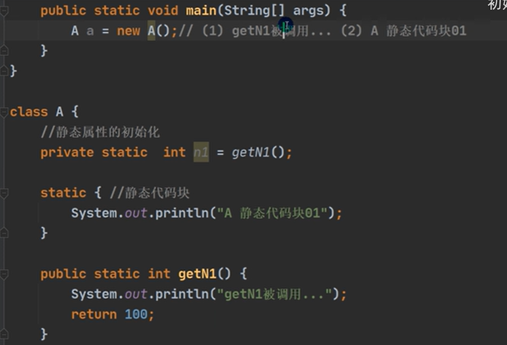
若类中代码块在下，方法在上输出会前后颠倒。这就是顺序<br>
而总体上静态>普通>构造器。也就是先加载类再创建对象。创建对象要从属性方法代码块初始化开始，到构造器（遇见了父类就套娃，而构造器暗中包括super构造器和普通代码块的调用）
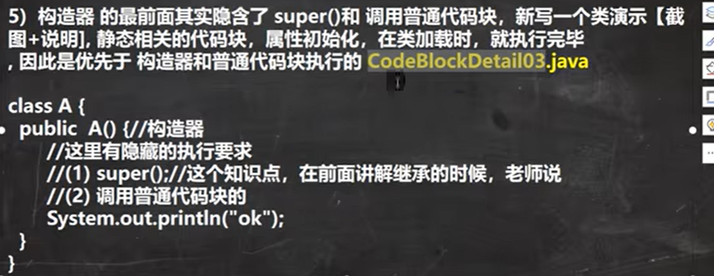
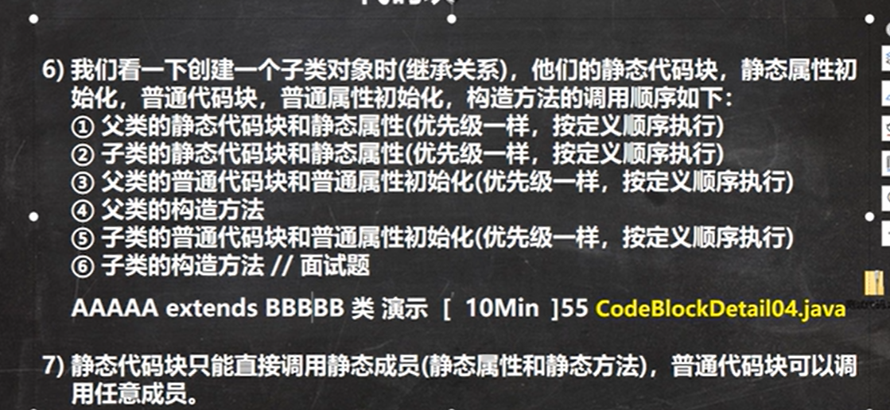
# 单例设计模式
应用于这个类一定从头到尾就一个对象

## 饿汉式
无论有没有使用在一开始类被加载就已经创建这个对象，就可能造成资源浪费

下面是代码
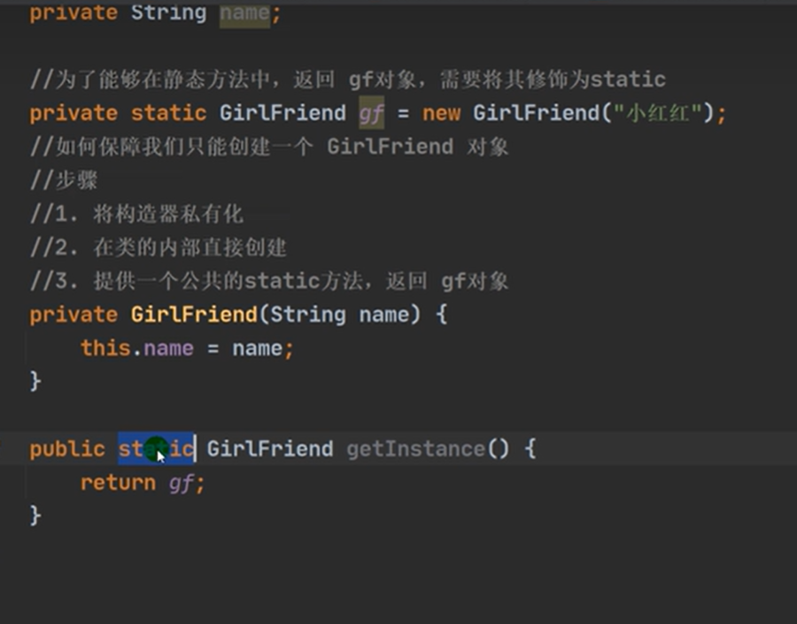
## 懒汉式

## 比较

# final
可以修饰类、方法、属性、和局部变量（方法里面的变量）

## 注意事项
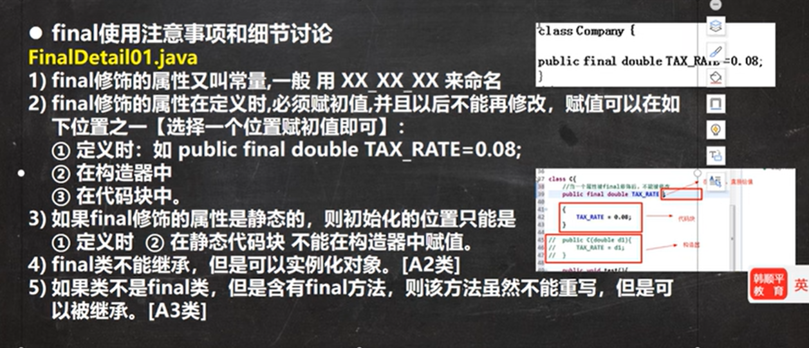
定义同时一定要赋值。若没有一句完成初始化声明，则可以在构造器和代码块这种你加载时必然完成同时赋值的地方进行补充赋值。<br>
4点是指你一个类被final修饰不能被继承但可以对此类实例化
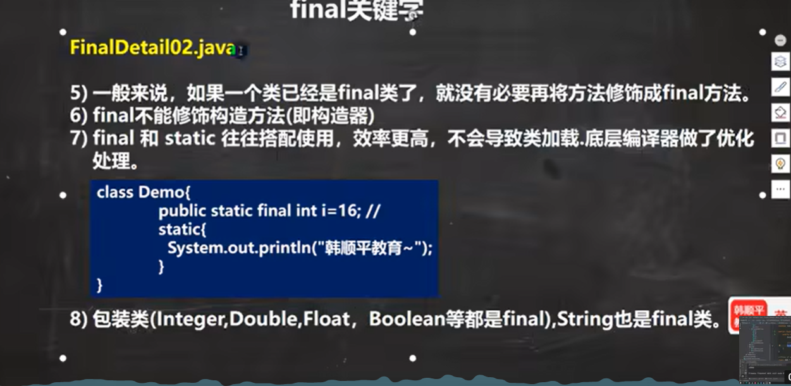         
7点是指搭配使用使得你既可以不实例一个对象再调用属性，同时调用这个值不会进行静态的一系列加载<br>
8点上那一堆都无法进行继承
# 抽象类
应用于暂时不清楚此方法如何实现的类

子类就像正常重写一样去
## 注意事项
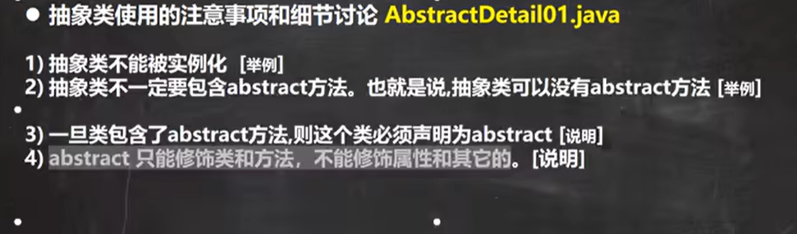
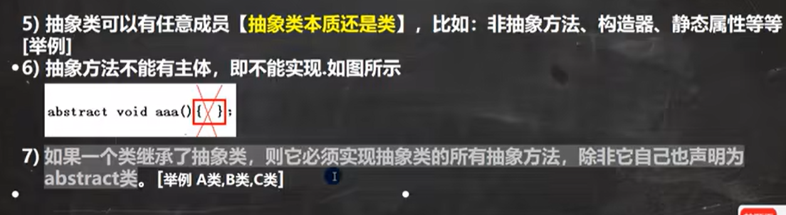

# 接口

也就是说接口中方法有三种：静态、抽象、默认实<br>
可以把把接口理解设计一个产品的都有哪些规格，而具体规格的实现由下面的类的来实现。在实际中会出现产品经理负责接口的编写，把接口的内容实现交给具体程序员来编写
## 注意事项

首先，实现接口的类方法不可除public以外的修饰（认为你缩小了接口范围），其次有快捷键可以在写实现接口类一键生成所有抽象方法的头（alt+enter）

一个类实现多个接口实例
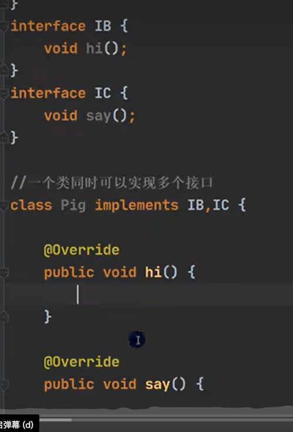

以上三种都编译通过，说明着接口既大致遵守着继承的规则，又遵循着静态的规则 
## 接口与继承类的区别

## 接口的多态特性
类似于我们在继承中的向上转型。多态数组的东西 


第二条那个call也就是继承子类想调用特有方法需要向下转型<br>
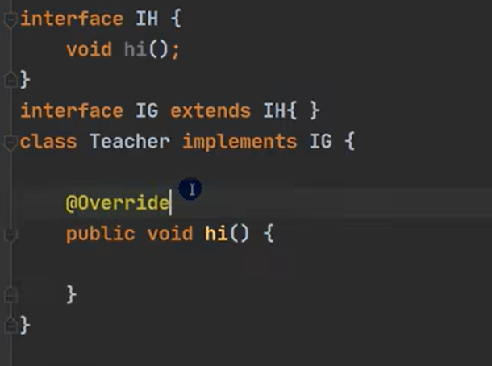

一点小知识点，类似于一个变量在子类父类同时定义在调用时的问题在接口中的体现

### 1. 场景 A：类实现了接口，且类自己也定义了同名变量

* **结论：** **不报错**。
* **规则：** 类自己定义的变量会“遮盖”住接口里的静态常量（即变量隐藏 Variable Hiding）。
* **调用方式：**
* 调用类自己的：直接写 `x` 或 `this.x`。
* 调用接口的：必须用 `接口名.x` (因为接口变量默认是 `static` 的)。


```java
interface A {
    int x = 100; // 默认是 public static final
}

class B implements A {
    int x = 200; // 类自己定义一个同名变量，完全没问题

    void show() {
        System.out.println(x);      // 输出 200 (默认就近原则，取类自己的)
        System.out.println(this.x); // 输出 200 (显式指代当前对象)
        System.out.println(A.x);    // 输出 100 (想要接口的，必须显式用接口名调用)
    }
}

```

### 2. 场景 B：类同时继承父类和实现接口，且父类与接口有同名变量

* **前提：** 子类 C 自己**没有**定义变量 `x`。
* **结论：** **编译报错！** (`Reference is ambiguous` / 引用不明确)
* **原因：** 当直接使用 `x` 时，编译器无法判断你到底想要父类的成员变量，还是接口的静态常量，产生了二义性。
* **解决方法：** 必须在代码中显式指定来源。

```java
interface A {
    int x = 100;
}

class Father {
    int x = 50;
}

// 类 C 既继承 Father 又实现 A，且 C 自己没有写 int x
class C extends Father implements A {
    void show() {
        // System.out.println(x); 
        // ❌ 编译错误：对 x 的引用不明确 (Reference to x is ambiguous)
        // 编译器疑惑：Father里有x，接口A里也有x，且都能访问，你到底指哪一个？
        
        // ✅ 正确写法：必须显式区分
        System.out.println(super.x); // 输出 50 (明确获取父类的)
        System.out.println(A.x);     // 输出 100 (明确获取接口的)
    }
}

```
###### 笔记最多的一集
# 内部类
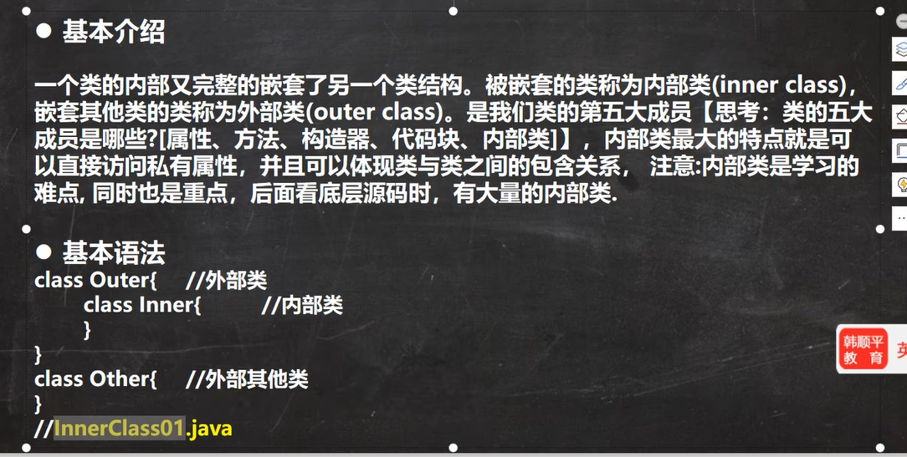
## 内部类分类
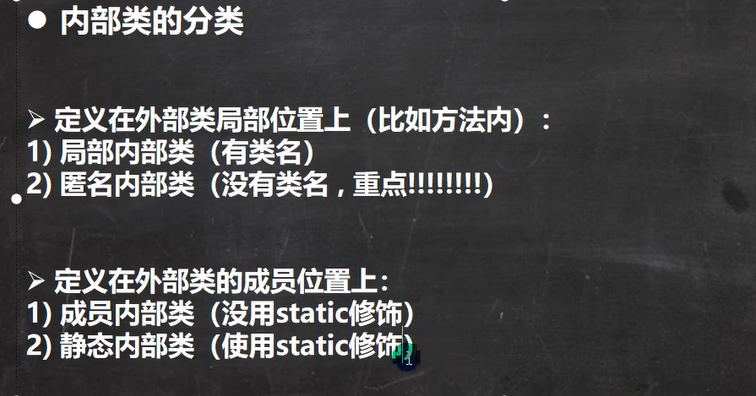
### 局部内部类
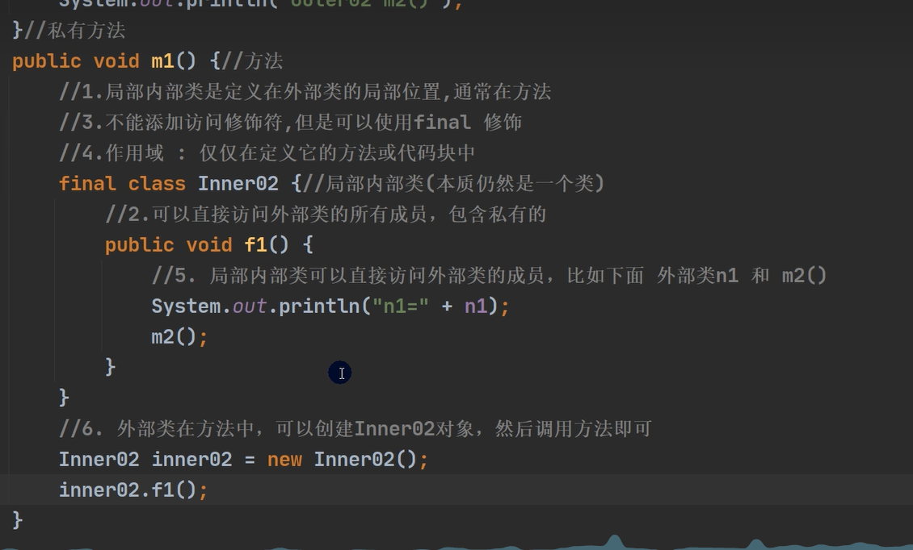
在方法/或者代码块中定义一个类，然后可以去在本方法/代码块中声明一个后进行调用
### 匿名内部类（用的最多）
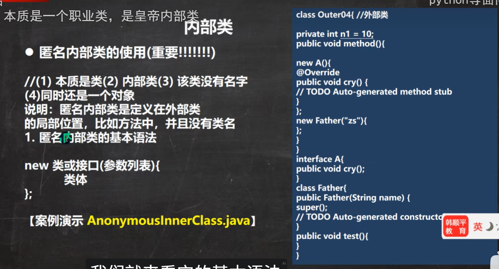

它实现的是如果想实现接口，但实现的这个类只使用一次，为此创建一个类很繁琐，因而设计匿名类来实现这个偷懒<br>
注意此时匿名类也遵循左边编译右边运行类型。也就是说匿名类的编译类型是接口，运行是匿名内部类。而底层其实是给你实现了创建了一个类并根据你{}中内容进行类定义后，去实现接口，然后返回给你直接让你可以创建一个对象去实现接口。这个类使了就无了，而表层我们new的对象可以多次使用。<br>
当然不只是基于接口的，还有基于类的。基于类的它就是起到省略一个创建实例继承某一类的作用，让你可以直接调用一个继承某个类的对象<br>
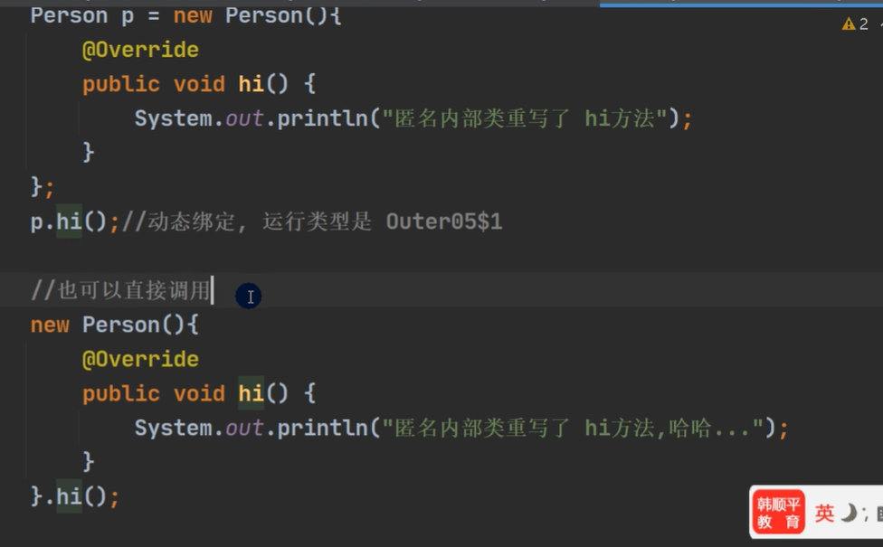
两种基于类的匿名内部类语法
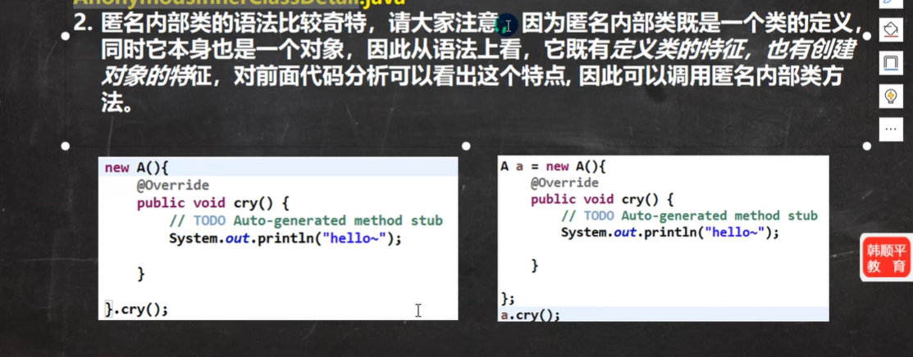
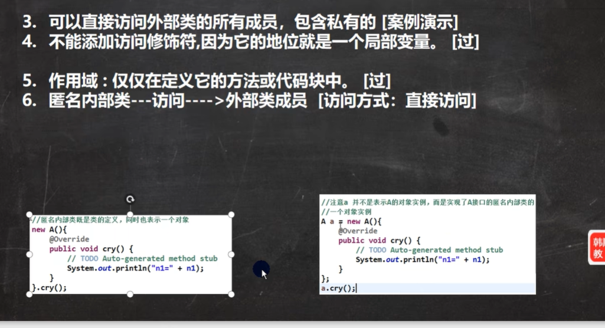
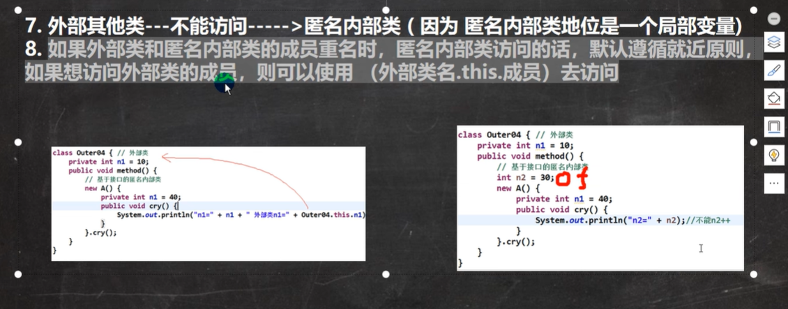
#### 实践
- 传参中，工作中常见
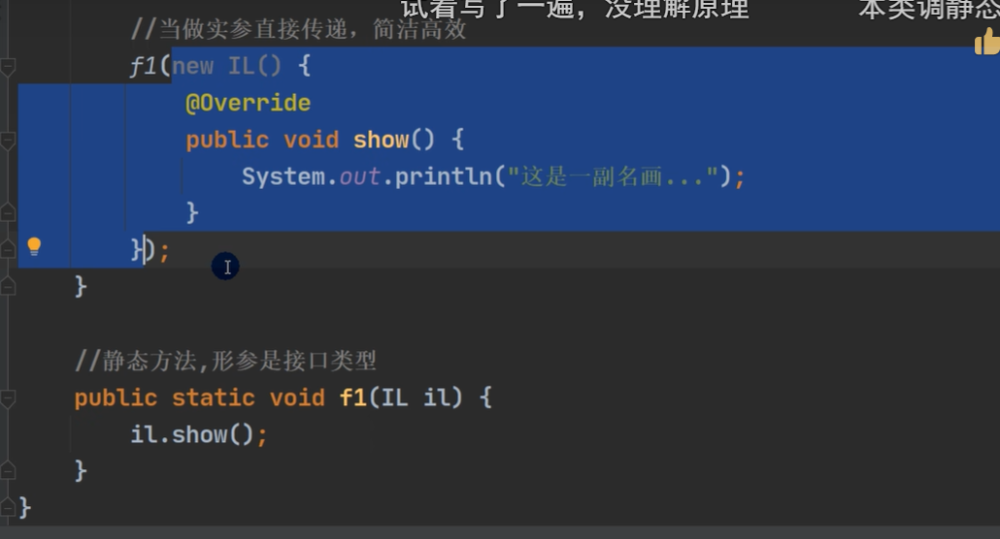
注意{}在传参括号中。如果不采用这种用传统的再创建一个类传进去是称为硬编码<br>
本质上是传了一个实现这个接口的匿名类对象过去，进行了向上转型。他的运行类型依旧是匿名类
### 成员内部类
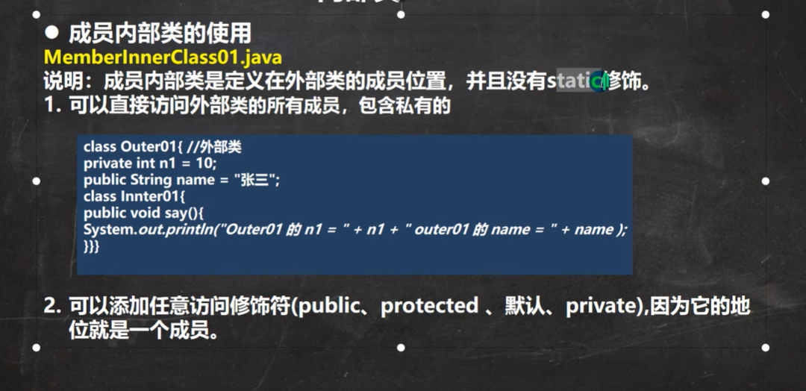
地位是一个成员，不在方法等等里面，可以被外部类任何地方进行调用，调用时外部类.内部类语法格式
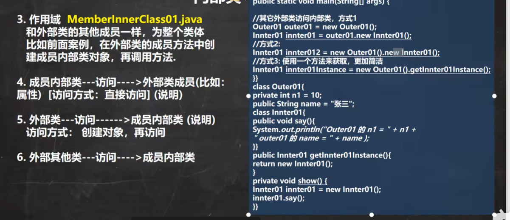
外部其他类去调用内部类有两种种方式
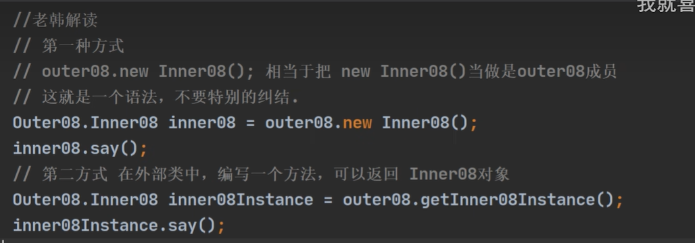
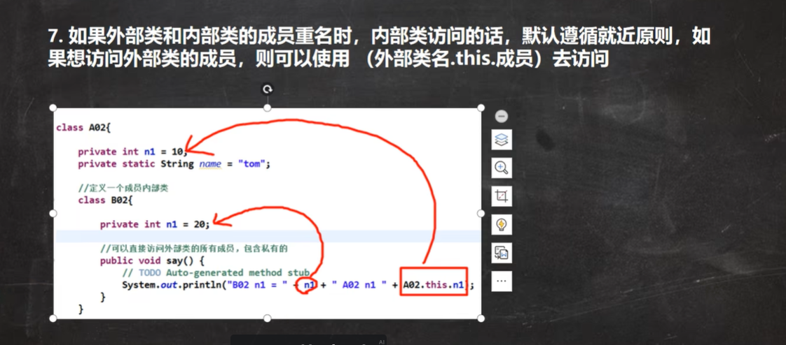
### 静态内部类
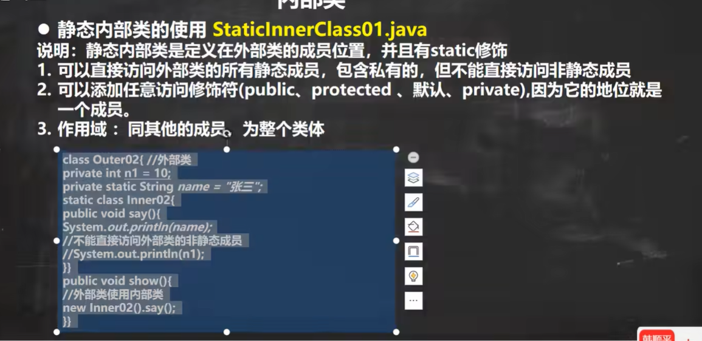
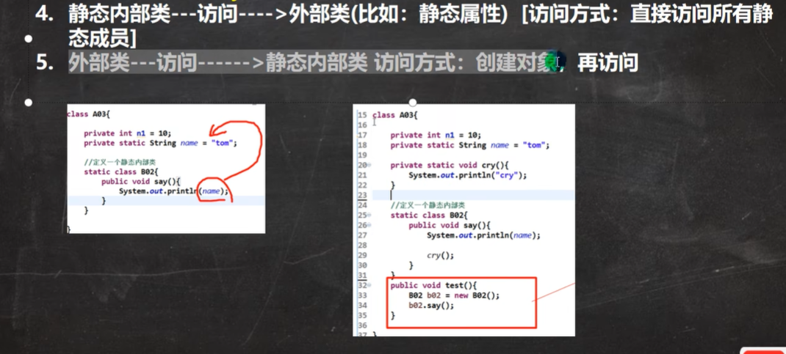
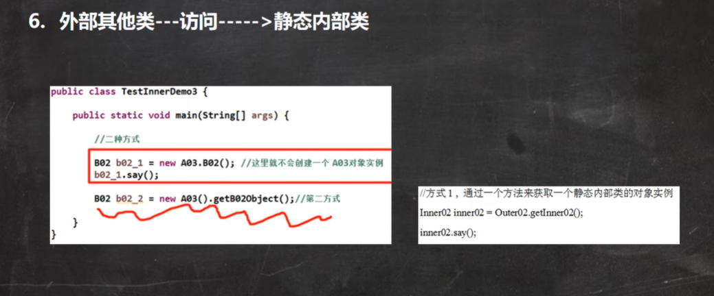
外部其他类访问类似
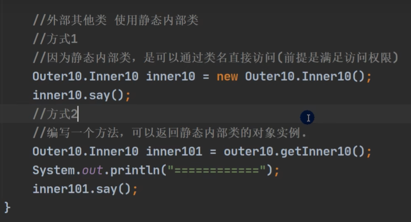
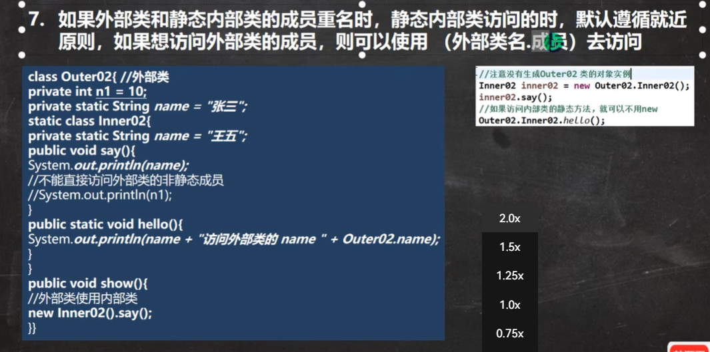 
